# Plan: Build the `coms-net` HTTP/SSE Pi Agent Communication Network

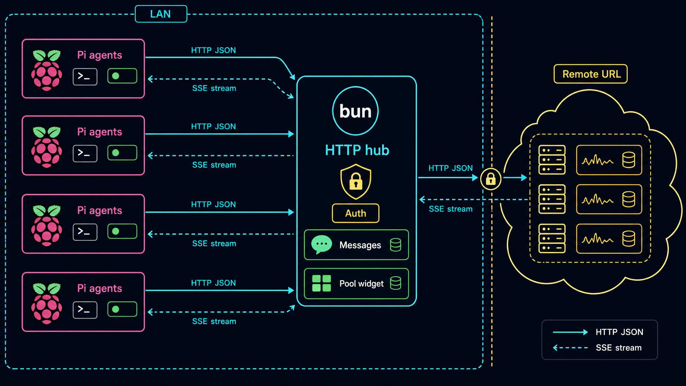

## Task Description

Implement `coms-net` exactly as specified in [`specs/coms-net-v1.md`](./coms-net-v1.md). The deliverable is a **dedicated Bun HTTP/SSE hub** plus a **Pi extension client** that, together, replace the unix-socket peer-to-peer transport from `coms` v1 with a centralized server architecture that works on localhost, LAN, and remote HTTPS.

The current `extensions/coms.ts` (1,597 lines, fully working — peer-to-peer over AF_UNIX / named pipes, registry-on-disk, self-healing heartbeat) stays **untouched** as the v1 fallback. `coms-net` ships in two new files plus a justfile/themeMap update:

```
extensions/coms-net.ts          # Pi extension client (HTTP/SSE)
scripts/coms-net-server.ts      # Bun HTTP/SSE hub server
extensions/themeMap.ts          # +1 line: "coms-net": "ocean-breeze"
justfile                        # +3 recipes: coms-net-server, coms-net-server-lan, ext-coms-net
```

Every user-facing primitive from `coms` v1 is preserved in shape but **renamed for complete separation**: four tools `coms_net_list`, `coms_net_send`, `coms_net_get`, `coms_net_await`, slash command `/coms-net`, bordered pool widget at `belowEditor`, `pi.registerFlag`-driven identity (`--name`, `--purpose`, `--project`, `--color`, `--explicit`), auto-suffix duplicate names, frontmatter `color` parsing, hex→ANSI swatch rendering, audit log via `pi.appendEntry`. New: `--server-url` and `--auth-token` flags, SSE event stream, server-side message TTL.

**Hard separation invariant.** `extensions/coms.ts`, `specs/coms-v1.md`, and `specs/coms-v1/` are **untouched** by this plan. The two extensions have **zero shared identifiers**: different tool names (`coms_*` vs `coms_net_*`), different slash command (`/coms` vs `/coms-net`), different widget key (`coms-pool` vs `coms-net-pool`), different audit channel (`coms-log` vs `coms-net-log`), different `customType` (`coms-inbound` vs `coms-net-inbound`), different registry root (`~/.pi/coms/` vs `~/.pi/coms-net/`). Both can be loaded simultaneously without any collision; recipes remain separate. Helpers are copy-pasted (not imported) so each file is fully self-contained.

The spec is the source of truth. This plan is the **execution** plan: who builds what, in what order, with what acceptance criteria, with the relevant section diagram embedded next to each task.

## Objective

When complete:

1. `bun scripts/coms-net-server.ts` boots cleanly, binds `127.0.0.1` on an OS-claimed port (`PI_COMS_NET_PORT=0`), prints the selected URL, writes `~/.pi/coms-net/projects/default/server.json`, and survives `Ctrl+C` with clean cleanup.
2. `pi -e extensions/coms-net.ts` reads the local `server.json` (or env/CLI), POSTs `/v1/agents/register`, opens an SSE stream on `/v1/events`, installs a bordered `coms-net-pool` widget at `belowEditor`, and updates `ctx.ui.setStatus("coms-net", "📡 <name>@<project>")`.
3. Two Pi instances connected to the same hub see each other within 1 second of registration via SSE `agent_joined` (no polling). The widget updates from `agent_updated` heartbeats every 10 s.
4. `coms_net_send` from agent A POSTs to `/v1/messages`, the server emits `prompt` over SSE to agent B, B's extension injects the prompt as `{ deliverAs: "followUp", triggerTurn: true }`, B's `agent_end` walks `ctx.sessionManager.getBranch()` and POSTs the assistant text to `/v1/messages/:id/response`, and A receives the response over SSE — making A's `coms_net_await` resolve.
5. Hop limit is server-enforced; messages are stored in memory with a 30-min TTL; auth is bearer-token on every `/v1/*`; the local-mode token is generated at server startup and stored at `~/.pi/coms-net/projects/<project>/server.secret.json` with `0600` perms.
6. A stress test runs three clients against one local hub for 90 seconds with no message loss, no leaked SSE streams, and no stale `server.json`.

## Problem Statement

`coms` v1 only works for agents on the same machine sharing a home directory. A user with two laptops on the same Wi-Fi can't pair them. A user running an agent on a VPS can't reach back to a local Pi. The unix-socket model also makes "an external dashboard" impossible — there's no central process holding pool state.

`coms-net` solves the cross-host problem **without** changing the user-facing tool surface. The four tools and the widget look the same; only the substrate changes. The server is a **dedicated process**, not an auto-spawned daemon — that decision is locked in v1 because hidden auto-spawning across machines creates more debugging pain than it saves.

The hard parts are the parts the v1 socket implementation didn't have to solve:

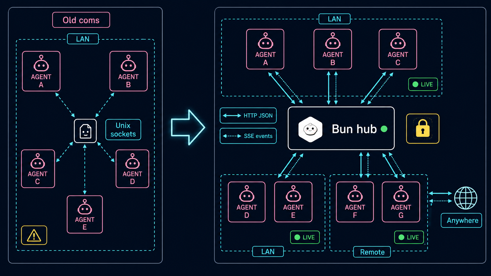

- **SSE parsing without a dependency** — the client uses native `fetch` streaming + a hand-rolled event parser (`TextDecoder` + split on blank line). No `eventsource` polyfill.
- **Long-poll `/v1/messages/:id/await`** — server holds the request open until response or timeout, releases all awaiters, then completes. Requires careful Promise plumbing.
- **Auth without leaking the token** — bearer header on every request including SSE; never log or print the raw token; widget/status line shows the URL but never the secret.
- **No auto-spawn** — if the extension can't find a healthy server, it must show a clear "start `bun scripts/coms-net-server.ts`" message and exit non-fatally, not silently start one.
- **State convergence on reconnect** — when SSE drops, the client reconnects with exponential backoff and asks for a fresh `pool_snapshot`; in-flight messages stay valid.

## Solution Approach

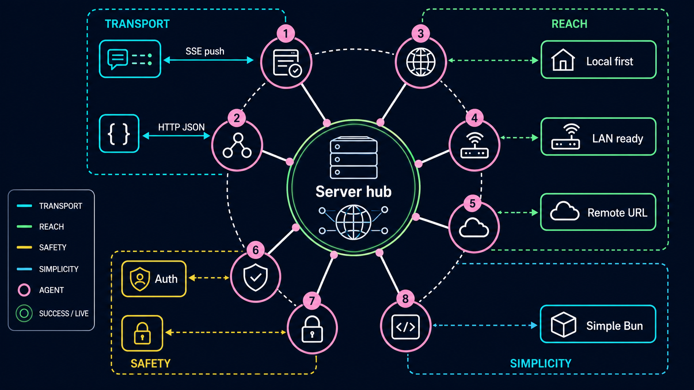

Build server-first, then client, then integrate. The protocol contract is the spec itself (§9 HTTP API, §11 SSE payloads, §10 Message model). Both halves must agree on:

- bearer auth header shape,
- envelope JSON keys,
- SSE event names (`hello`, `pool_snapshot`, `agent_joined`, `agent_updated`, `agent_stale`, `agent_left`, `prompt`, `response`, `message_status`, `server_ping`, `error`),
- error response shape on 4xx,
- message status state machine (`queued → delivered → complete | error | timeout`). Note: `in_progress` is intentionally **dropped from v1** (no client/server action sets it; defer to v2 if streaming progress becomes valuable).

**Shared TypeScript types are inlined twice** — once in the server, once in the client — so each file remains fully self-contained per the hard-separation invariant. No third file (no `extensions/coms-net-types.ts`). The Build Sheet from `scout-net` provides the canonical types block to paste into both files verbatim. If the types ever diverge, the reviewer flags it.

**Six open questions resolved per spec §20 recommendations** (locked unless the user overrides):

| # | Question | Resolution |
|---|---|---|
| 1 | Default bind | `127.0.0.1`; LAN requires explicit `PI_COMS_NET_HOST=0.0.0.0` |
| 2 | Auto-spawn server? | No. Manual `bun scripts/coms-net-server.ts` only |
| 3 | Persist messages? | No. In-memory + 30-min TTL. Audit via `coms-net-log` |
| 4 | Confirm prompt gate for remote senders? | No, but display sender name/cwd/project in inbound; future hook |
| 5 | Multi-project per token? | Yes for local/LAN; per-project tokens deferred to v2 |
| 6 | Tool naming | Rename to `coms_net_*` for **complete separation** from v1's `coms_*`. Both extensions can be loaded together without identifier collision |

**Reuse from `coms` v1 verbatim:**

- `parseFrontmatter` regex (no yaml dep): `extensions/coms.ts:170-192`.
- `ulid()` inline + Crockford base32: `extensions/coms.ts:131-152`.
- `hexFg(hex, str)` raw ANSI helper: `extensions/coms.ts:154-159`.
- `resolveUniqueName(project, desiredName)` auto-suffix logic: `extensions/coms.ts:331-340`.
- `pi.registerFlag` declarations at top of default export: `extensions/coms.ts:535-559`.
- Bordered widget rendering with local name in top-right: `extensions/coms.ts:955-1079`.
- TypeBox + renderCall + renderResult tool registration: `extensions/coms.ts:1186-1475`.
- `pi.sendMessage(..., { deliverAs: "followUp", triggerTurn: true })`: `extensions/coms.ts:626-640`.
- `pi.on("agent_end", …)` walking `ctx.sessionManager.getBranch()` for last assistant text: `extensions/coms.ts:1479-1497`.

**Decompose** into: scout → builder-server (3 resumed phases) || builder-client (3 resumed phases) || builder-meta → reviewer → validator → two parallel testers (curl-based server protocol + drive-based client roundtrip). The two builders can run in true parallel because the server lives in `scripts/` and the client lives in `extensions/` — zero file overlap.

## Relevant Files

Use these files to complete the task:

- [`specs/coms-net-v1.md`](./coms-net-v1.md) — source of truth. Every section below maps to a code region.
- [`specs/coms-net-v1/`](./coms-net-v1/) — 19 reference diagrams. Each task in this plan embeds the matching diagram for visual context.
- `extensions/coms.ts` (1,597 lines) — the working v1 socket implementation. Re-use frontmatter parser, ulid, hexFg, resolveUniqueName, pool widget rendering, tool render hooks, agent_end response capture verbatim. Replace only the transport layer.
- `extensions/themeMap.ts` — one-line addition: `"coms-net": "ocean-breeze"` near the existing `"coms"` entry.
- `extensions/subagent-widget.ts:196-200` — canonical `pi.sendMessage` followUp pattern (still applies).
- `extensions/tool-counter.ts:39-46` — canonical `ctx.sessionManager.getBranch()` walk for last assistant text.
- `extensions/minimal.ts:21-24` — canonical `ctx.getContextUsage()` percent extraction.
- `extensions/cross-agent.ts:20-37` — raw ANSI hex helper (also in `coms.ts`).
- `extensions/themeMap.ts:140-143` — `applyExtensionDefaults(import.meta.url, ctx)` bootstrap convention.
- `THEME.md` — color role conventions (`accent`, `success`, `warning`, `dim`, `muted`, `border`).
- `.pi/themes/synthwave.json` — palette source for fallback agent colors.
- `package.json` — must remain unchanged (no new runtime deps; Bun + Node stdlib + existing imports cover everything).
- `justfile` — append three recipes after the existing `ext-coms-team-4` recipe.

### New Files

- `scripts/coms-net-server.ts` — Bun HTTP/SSE hub. Single file, ~700–900 lines.
- `extensions/coms-net.ts` — Pi extension client. Single file, ~1,400–1,700 lines (mirrors `coms.ts` shape, swaps transport).

`scripts/` does not yet exist at the project root; the builder-meta task creates it.

## Implementation Phases

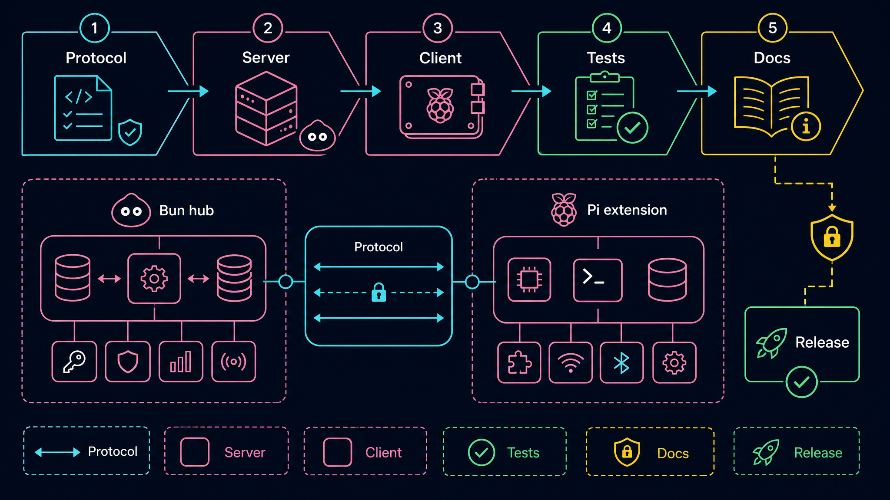

### Phase 1: Foundation — Protocol + Server Bind

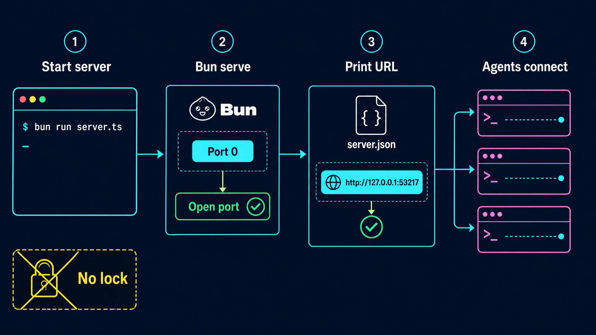

**Owner: `builder-server` (Phase A)** — scaffold the Bun server up to first health check.

1. Create `scripts/coms-net-server.ts`. Imports: Bun (no import — globals), `node:fs`, `node:path`, `node:os`, `node:crypto`.
2. Read env vars at top: `PI_COMS_NET_HOST` (default `127.0.0.1`), `PI_COMS_NET_PORT` (default `0`), `PI_COMS_NET_PUBLIC_URL` (optional), `PI_COMS_NET_PROJECT` (default `default`), `PI_COMS_NET_AUTH_TOKEN` (optional; if absent, server generates a random token for local dev).
3. Inline ULID generator (copy from `coms.ts:131-152`).
4. `Bun.serve({ hostname, port, fetch })` with a single `fetch` router. Capture `server.port` after startup → that's the claimed port.
5. Compute `localUrl = http://${host}:${claimedPort}` (rewrite `0.0.0.0` → `127.0.0.1` for the local URL).
6. Write `~/.pi/coms-net/projects/<project>/server.json`:
   ```json
   { "version": 1, "project": "...", "pid": ..., "host": "...", "port": ..., "local_url": "...", "public_url": "...", "started_at": "..." }
   ```
   Use atomic write: `.tmp` + `renameSync`. NEVER include the auth token in `server.json`.
7. **Token policy by bind interface (loopback-vs-LAN guard):**
   - If `PI_COMS_NET_AUTH_TOKEN` is set → use it. Do NOT write `server.secret.json`.
   - Else if bind is loopback (`127.0.0.1` / `::1`) → generate a random token, write `~/.pi/coms-net/projects/<project>/server.secret.json` with `{ "token": "..." }` and `chmod 0600`. Track that this file was server-generated (so shutdown can clean it up).
   - Else (non-loopback bind, e.g. `0.0.0.0` for LAN, or any other IP) → **fail startup with a clear error**: `coms-net: refusing to bind <host> without an explicit PI_COMS_NET_AUTH_TOKEN. Set the env var or use --port-forwarding for local-only.` Do NOT auto-generate for LAN.
8. **Entrypoint guard.** Wrap the `Bun.serve` boot + side-effects (server.json write, token generation, SIGINT install) in a `main()` function and call it only inside `if (import.meta.main) { main(); }`. Export the helpers/types so import smoke (`bun -e "import('scripts/coms-net-server.ts')"`) loads the module without starting the server. Without this guard, the import smoke will hang because the server stays alive.
9. Print the URL, project, and PID on startup. If a token was generated, print only the path to `server.secret.json` (NEVER the token value).
10. `GET /health` returns `{ ok: true, version: 1, server_id, started_at }` — does NOT require auth.
11. Auth middleware: every `/v1/*` request must carry `Authorization: Bearer <token>`. Compare with constant-time string compare (`crypto.timingSafeEqual`, with explicit length-equal guard before the call).
12. Install `SIGINT` / `SIGTERM` handlers: stop server, unlink `server.json` (best-effort), unlink `server.secret.json` IF the server generated it (best-effort), exit.
13. Verify: `bun scripts/coms-net-server.ts` prints a URL, `curl http://127.0.0.1:<port>/health` returns `{ "ok": true, ... }`, `curl http://127.0.0.1:<port>/v1/agents` returns `401 Unauthorized` without bearer. After SIGINT, both `server.json` and the generated `server.secret.json` are gone (project dir is empty). Import smoke (with guard) succeeds without starting the server.

### Phase 2: Core Server — Registry + Routes + SSE

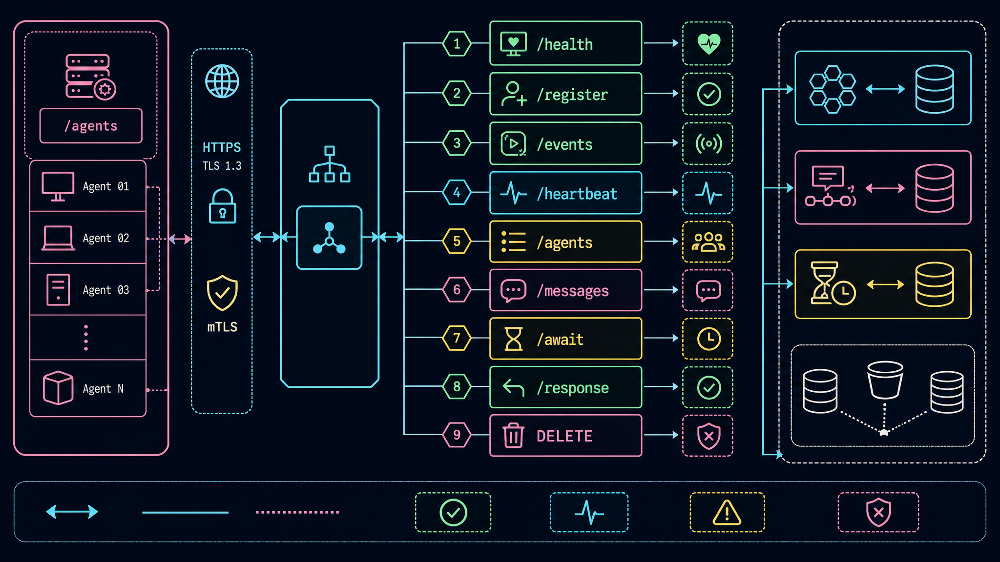
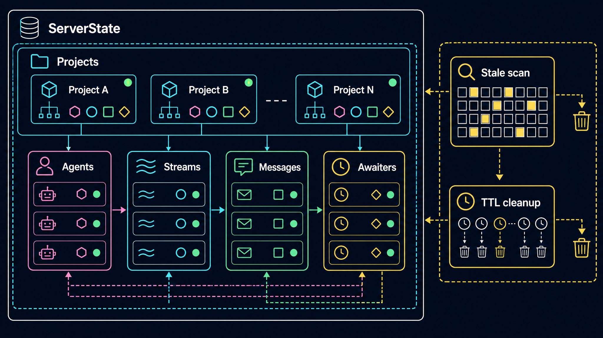

**Owner: `builder-server` (Phase B)** — Pi-API surface + SSE.

1. In-memory state (single `ServerState` object on module scope):
   ```ts
   const state = {
     server_id: ulid(),
     started_at: nowIso(),
     projects: new Map<string, ProjectState>(),
   };
   type ProjectState = {
     agents: Map<string, AgentRecord>;       // session_id → record
     nameIndex: Map<string, Set<string>>;    // name → session_ids
     messages: Map<string, ComsMessage>;
     streams: Map<string, SseClient>;        // session_id → writer
     awaiters: Map<string, Set<Awaiter>>;    // msg_id → pending /await responses
   };
   ```
2. SSE writer helper:
   ```ts
   function sseSend(stream, event, data) {
     stream.write(`event: ${event}\nid: ${++stream.lastId}\ndata: ${JSON.stringify(data)}\n\n`);
   }
   ```
   Use Bun's `ReadableStream` with `start(controller)` + `controller.enqueue` for each frame. Heartbeat-comment every 15 s (`: ping <iso>\n\n`) to keep proxies open.
3. `POST /v1/agents/register` — parse body, generate or accept session_id, server-side `resolveUniqueName(project, desiredName)`, insert into `agents`, emit `agent_joined` to existing streams, return `{ ok, agent, heartbeat_interval_ms: 10000, sse_url }`.
4. `GET /v1/events?project=&session_id=` — SSE handler. Send `hello` then `pool_snapshot`. Park the stream in `streams.set(session_id, ...)`. On `req.signal.aborted`, mark agent stale, emit `agent_left` with `reason: "connection_closed"`.
5. `POST /v1/agents/:session_id/heartbeat` — update `last_seen_at`, dynamic card fields (`context_used_pct`, `queue_depth`, `model`), emit `agent_updated` if visible values changed.
6. `GET /v1/agents?project=&include_explicit=` — return live snapshot of the project pool.
7. `POST /v1/messages` — parse, resolve target by `target_session` or unambiguous `target` name (404/409 on miss), enforce `MAX_HOPS`, generate `msg_id`, insert message, emit SSE `prompt` to target, emit `message_status` to sender, return `{ ok, msg_id, status: "queued", target_session }`.
8. `GET /v1/messages/:msg_id` — non-blocking status poll.
9. `GET /v1/messages/:msg_id/await?timeout_ms=` — long-poll. Park request in `awaiters.set(msg_id, set)`. Resolve when message becomes terminal (`complete | error | timeout`). Default `timeout_ms = 30000`. Server-side max: `MESSAGE_TTL_MS`.
10. `POST /v1/messages/:msg_id/response` — verify `responder_session` matches `target_session`, mark complete/error, emit SSE `response` to sender, release all awaiters on `msg_id`.
11. `DELETE /v1/agents/:session_id` — mark offline, close SSE stream, emit `agent_left` with `reason: "shutdown"`.
12. Verify with curl: register two synthetic agents (different session_ids), check `/v1/agents` shows both, check that opening an SSE stream emits `hello + pool_snapshot`, send a message between them, verify the SSE stream of the target receives the `prompt` event.

### Phase 3: Server Cleanup — Stale Detection + TTL

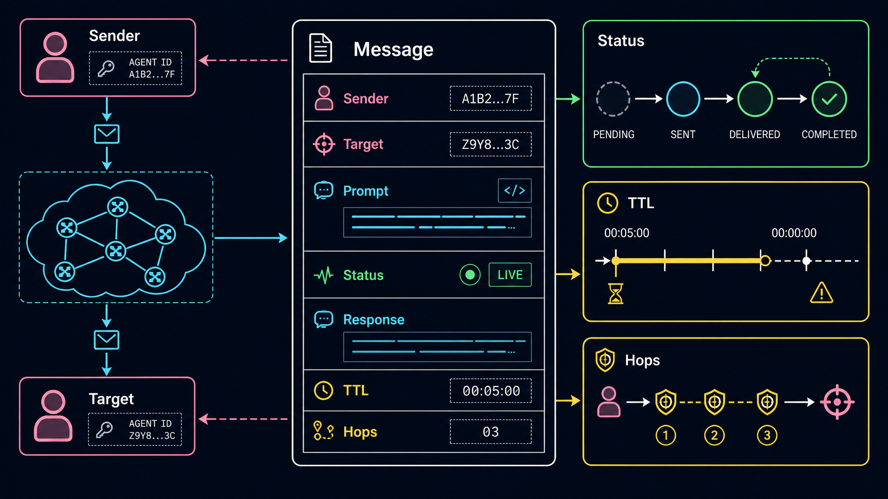
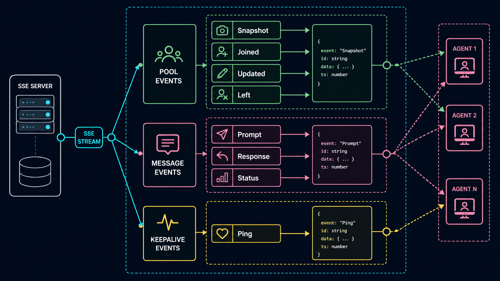

**Owner: `builder-server` (Phase C)** — background loops.

1. Stale scan loop (every 5 s):
   - For each agent, if `now - last_seen_at > STALE_AFTER_MS` (30 s), mark stale, emit `agent_stale`.
   - If `now - last_seen_at > OFFLINE_AFTER_MS` (60 s), remove, emit `agent_left` with `reason: "stale"`, close any open stream.
2. Message TTL cleanup loop (every 10 s):
   - Expire queued messages older than `MESSAGE_TTL_MS` (30 min) → mark `error: "expired"`, release awaiters.
   - Expire complete messages after TTL.
   - Cap inbox per target at `MAX_INBOX_PER_TARGET` (100); reject new sends with `429` and `error: "inbox full"`.
3. SSE keepalive comment every 15 s on every open stream.
4. On `SIGINT`/`SIGTERM`: stop loops, send `agent_left` with `reason: "shutdown"` to all streams, close streams, unlink `server.json`, exit 0.
5. Verify: kill an agent's heartbeat (don't send for >30 s); the server emits `agent_stale` to other streams. After 60 s, emits `agent_left`.

### Phase 4: Client Foundation — Identity + Auth + Server Resolution

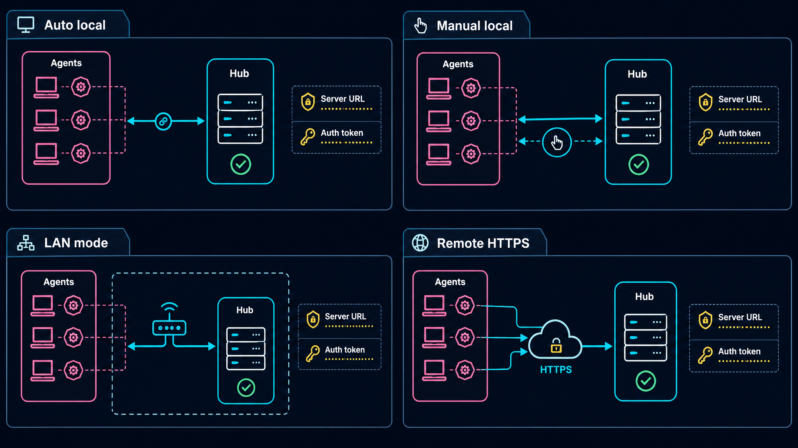
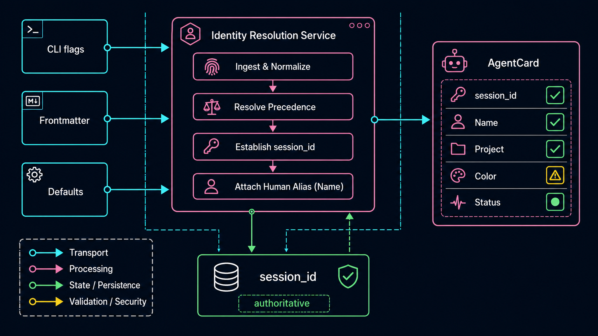

**Owner: `builder-client` (Phase A)** — Pi extension scaffold.

1. Create `extensions/coms-net.ts`. Imports mirror `extensions/coms.ts:16-26` minus `node:net` (replace with no extra net imports — use global `fetch`).
2. Register identity flags via `pi.registerFlag` at top of default export (mirror `coms.ts:535-559`). Add **two new flags**: `server-url` (string, no default), `auth-token` (string, no default).
3. Constants from env:
   ```ts
   const SERVER_URL_ENV = process.env.PI_COMS_NET_SERVER_URL;
   const AUTH_TOKEN_ENV = process.env.PI_COMS_NET_AUTH_TOKEN;
   const PROJECT_ENV = process.env.PI_COMS_NET_PROJECT;
   const HEARTBEAT_MS = 10_000;
   const RECONNECT_BASE_MS = 500;
   const RECONNECT_MAX_MS = 10_000;
   ```
4. Copy verbatim from `extensions/coms.ts`: `ulid`, `hexFg`, `isValidHex`, `fallbackColor`, `parseFrontmatter`, `nowIso`, `abbreviateModel`, `findSystemPromptPath`, `readFrontmatterFromArgv`. Same regexes, same Crockford alphabet — no behavioral drift.
5. Adapt `resolveUniqueName` to call the server (`POST /v1/agents/register` returns the resolved name) — the extension does NOT need to check the registry directly. The server is the source of truth. Local agent name resolution becomes "what we asked for"; the canonical name comes back in the registration response.
6. Server URL resolution function (in priority order):
   1. CLI flag `--server-url`
   2. `PI_COMS_NET_SERVER_URL` env
   3. `~/.pi/coms-net/projects/<project>/server.json` (read `local_url`)
   4. None → notify clearly, exit gracefully (don't auto-spawn)
7. Auth token resolution function (in priority order):
   1. CLI flag `--auth-token`
   2. `PI_COMS_NET_AUTH_TOKEN` env
   3. `~/.pi/coms-net/projects/<project>/server.secret.json` (read `token`, only if file mode is `0600`)
   4. None → notify clearly, exit gracefully
8. `httpFetch(method, path, body)` helper that adds `Authorization: Bearer <token>`, `Content-Type: application/json`, and throws structured errors on non-2xx responses (`HttpError { status, body }`).
9. Verify with a unit-style smoke check: assert `httpFetch("GET", "/health")` succeeds against a manually-running server.

### Phase 5: Client SSE + Tools + Lifecycle

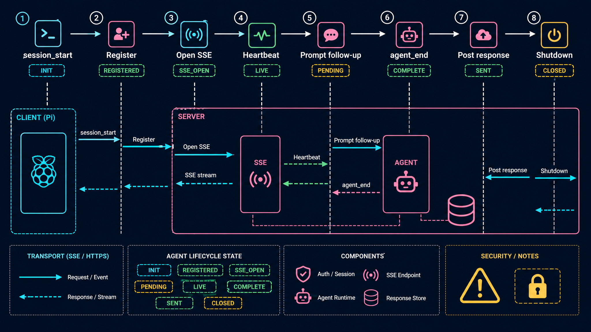
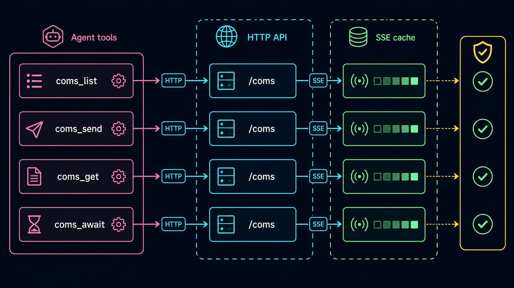

**Owner: `builder-client` (Phase B)** — register, SSE, tools, hooks. Resumed.

1. `session_start` handler:
   1. `applyExtensionDefaults(import.meta.url, ctx)`.
   2. Resolve identity (CLI > frontmatter > defaults), color (with palette fallback), project, explicit.
   3. Resolve `server_url` and `auth_token`. If either missing, `ctx.ui.notify(...)` and return early.
   4. `httpFetch("GET", "/health")` — fail clearly if unreachable.
   5. `POST /v1/agents/register` with the agent card.
   6. Use the server-returned `agent.name` (might be auto-suffixed).
   7. Open SSE: `fetch(serverUrl + sse_url, { headers: { Authorization, Accept: "text/event-stream" } })`. Stream the body via `ReadableStreamDefaultReader.read()`; parse with hand-rolled SSE parser.
   8. Install `coms-net-pool` widget at `belowEditor`.
   9. `ctx.ui.setStatus("coms-net", "📡 ${name}@${project}")`.
   10. Start heartbeat interval (10 s): `POST /v1/agents/:session_id/heartbeat` with `context_used_pct`, `queue_depth`, `model`.
2. Hand-rolled SSE parser:
   ```ts
   function makeSseParser(onEvent) {
     const decoder = new TextDecoder();
     let buf = "";
     return (chunk: Uint8Array) => {
       buf += decoder.decode(chunk, { stream: true });
       let idx;
       while ((idx = buf.indexOf("\n\n")) >= 0) {
         const frame = buf.slice(0, idx);
         buf = buf.slice(idx + 2);
         let event = "message", data = "", id = "";
         for (const line of frame.split("\n")) {
           if (line.startsWith(":")) continue;
           if (line.startsWith("event:")) event = line.slice(6).trim();
           else if (line.startsWith("data:")) data += line.slice(5).trim();
           else if (line.startsWith("id:")) id = line.slice(3).trim();
         }
         if (data) onEvent(event, JSON.parse(data), id);
       }
     };
   }
   ```
3. SSE event dispatch:
   - `pool_snapshot` → replace `peerCards` cache.
   - `agent_joined` / `agent_updated` → upsert.
   - `agent_stale` → mark stale.
   - `agent_left` → remove.
   - `prompt` → record `inboundContext`, call `pi.sendMessage({ customType: "coms-net-inbound", content: "[from <sender.name> @ <sender.cwd>]\n\n<prompt>", display: true, details: { msg_id, sender_session, response_schema, hops } }, { deliverAs: "followUp", triggerTurn: true })`.
   - `response` → look up `pendingReplies`, resolve.
   - `message_status` → update local map (informational).
   - `error` → log to `coms-net-log`.
4. Reconnect logic: on stream close/error, exponential backoff (`base * 2^attempts`, capped at `RECONNECT_MAX_MS`). On reconnect, re-`POST /v1/agents/register` (server treats as upsert) and re-open SSE. The server resends `pool_snapshot` automatically.
5. Register the four tools (TypeBox + renderCall + renderResult — copy structure from `coms.ts:1186-1475`):
   - `coms_net_list` → `GET /v1/agents`
   - `coms_net_send` → `POST /v1/messages`, register `pendingReplies` entry, return `msg_id`
   - `coms_net_get` → check `pendingReplies` first; fall back to `GET /v1/messages/:id`
   - `coms_net_await` → `GET /v1/messages/:id/await?timeout_ms=` (server long-poll). Race against local SSE-resolved entry if already known.
6. Register `/coms-net` slash command (mirror `coms.ts:1552-1567` shape but the registered name is `coms-net`, not `coms`). Add `--server` (print URL/health) and `--reconnect` (close + reopen SSE) sub-args.
7. `pi.on("agent_end", …)` capture: walk `ctx.sessionManager.getBranch()`, find the most recent unfulfilled inbound, validate against `response_schema` if present, `POST /v1/messages/:msg_id/response`. Clear inbound.
8. Audit log via `pi.appendEntry("coms-net-log", …)` at boot, register, sse_open, prompt_in, prompt_out, response_in, response_out, sse_reconnect, shutdown.

### Phase 6: Client Widget + Shutdown

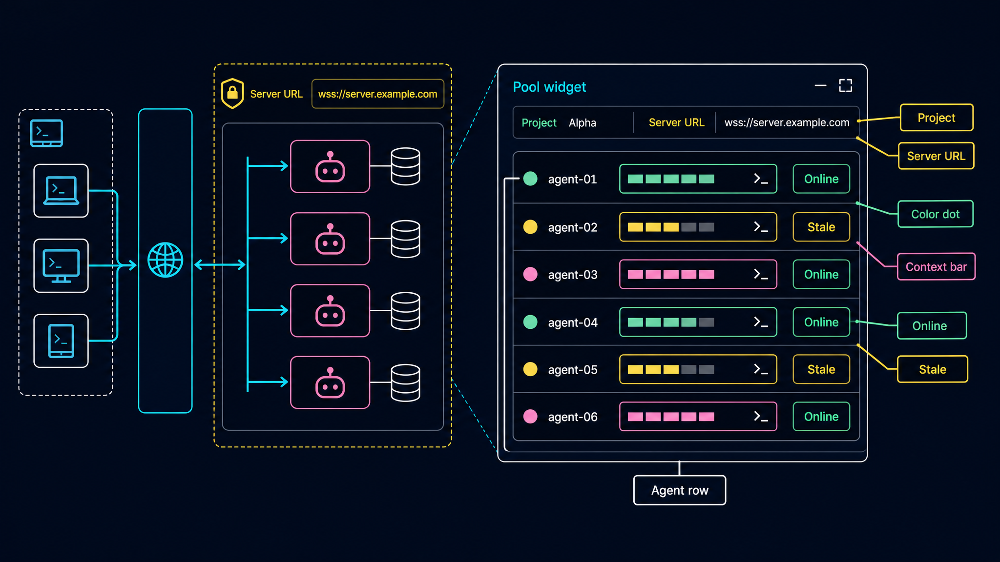
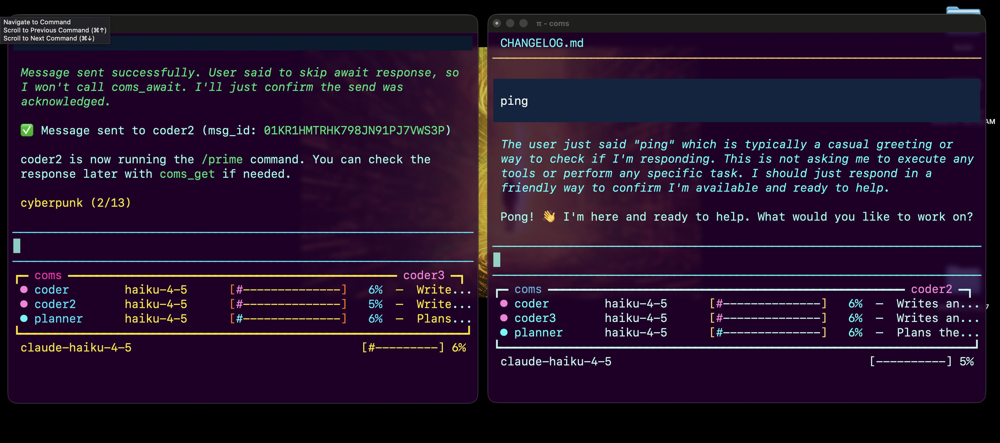

**Owner: `builder-client` (Phase C)** — UI polish + clean lifecycle. Resumed.

1. `renderPool(width, theme)` mirrors `coms.ts:955-1079` exactly. Differences:
   - widget key: `"coms-net-pool"` (not `"coms-pool"`).
   - top-border tag: `┏━ coms-net ━...━ <local-name> ━┓` using `theme.fg("dim", …)` for dashes and `hexFg(identity.color, identity.name)` for the local name.
   - data source: `peerCards` driven by SSE events (no polling).
   - widget render is read-only — no fetch, no fs.
2. Widget updates trigger `tui.requestRender()` only when `peerCards` content changes.
3. `session_shutdown` + `SIGINT` + `SIGTERM`:
   - clear heartbeat interval
   - close SSE stream (abort the underlying `AbortController`)
   - `DELETE /v1/agents/:session_id` best-effort (1 s timeout)
   - `pi.appendEntry("coms-net-log", { event: "shutdown", ... })`
   - clear widget (`ctx.ui.setWidget("coms-net-pool", undefined)`)
4. Never call `ctx.ui.setFooter` — same cardinal rule as v1.

## Team Orchestration

- You operate as the team lead and orchestrate the team to execute the plan.
- You're responsible for deploying the right team members with the right context to execute the plan.
- IMPORTANT: You NEVER operate directly on the codebase. You use `Task` and `Task*` tools to deploy team members.
  - Your role is to validate all work is going well and make sure the team is on track to complete the plan.
- Take note of the session id of each team member. This is how you'll reference them.

### Team Members

- Scout
  - Name: `scout-net`
  - Role: Read `specs/coms-net-v1.md` end-to-end. Re-read `extensions/coms.ts` for the verbatim-reuse helpers (frontmatter, ulid, hexFg, resolveUniqueName, widget render, render hooks, agent_end). Check Bun docs for `Bun.serve` SSE patterns and `ReadableStream` semantics. Produce a "Build Sheet" markdown blob (returned as final message, NOT saved to disk) with: (a) every Pi extension API call signature pulled from the docs and `coms.ts`, (b) the exact verbatim helpers to copy, (c) the canonical `Bun.serve` route + SSE skeleton, (d) the exact env-var names and defaults from spec §6, (e) the SSE event names from spec §11, (f) a pre-built TypeScript types block (`AgentCard`, `RegistryEntry`, `ComsMessage`, `Envelope shapes`) shared between server and client. Keep it under 500 lines.
  - Agent Type: `general-purpose`
  - Resume: false

- Builder (server)
  - Name: `builder-server`
  - Role: Build all of `scripts/coms-net-server.ts`. Three resumed phases: A (foundation: bind, health, auth middleware, server.json + server.secret.json), B (routes: register, events SSE, heartbeat, agents, messages, await, response, delete), C (cleanup loops: stale scan, TTL cleanup, SIGINT/SIGTERM).
  - Agent Type: `general-purpose`
  - Resume: true (across A → B → C)

- Builder (client)
  - Name: `builder-client`
  - Role: Build all of `extensions/coms-net.ts`. Three resumed phases: A (foundation: identity flags, server URL/token resolution, httpFetch helper, frontmatter+ulid+hexFg copies), B (SSE parser + register + tools + hooks + reconnect), C (widget + shutdown). Pulls verbatim helpers from `extensions/coms.ts`.
  - Agent Type: `general-purpose`
  - Resume: true (across A → B → C)
  - Runs in **parallel** with `builder-server`.

- Builder (meta-files)
  - Name: `builder-meta`
  - Role: Create `scripts/` directory if missing. Add `"coms-net": "ocean-breeze",` to `extensions/themeMap.ts` near the existing `"coms"` entry. Add three recipes to `justfile`: `coms-net-server`, `coms-net-server-lan`, `ext-coms-net` (after the existing `ext-coms-team-4` recipe).
  - Agent Type: `general-purpose`
  - Resume: false

- Reviewer
  - Name: `reviewer-net`
  - Role: Static spec-compliance review. Reads `specs/coms-net-v1.md`, `scripts/coms-net-server.ts`, `extensions/coms-net.ts`. Verify: (a) bearer auth on every `/v1/*` (grep `Authorization` checked in router), (b) no `setFooter` in client (`grep -n "setFooter" extensions/coms-net.ts` empty), (c) widget key is `coms-net-pool` and placement is `belowEditor`, (d) all four tools registered with TypeBox + renderCall + renderResult, (e) `pi.sendMessage` called with `deliverAs: "followUp"` and `customType: "coms-net-inbound"`, (f) `pi.appendEntry("coms-net-log", …)` at minimum 6 events (boot, register, sse_open, prompt_in, response_out, shutdown), (g) all 11 SSE event names handled, (h) hop limit enforced server-side, (i) message TTL cleanup loop present, (j) `server.json` and `server.secret.json` written atomically with correct permissions, (k) auth token never logged or written into `server.json`, (l) no auto-spawn from extension, (m) reconnect with exponential backoff up to 10 s. Returns pass/fail with line numbers; on fail, orchestrator resumes the matching builder.
  - Agent Type: `general-purpose`
  - Resume: false

- Validator
  - Name: `validator-net`
  - Role: Toolchain + smoke. (1) `bun --version` and `pi --version` clean. (2) `bun --silent -e "import('scripts/coms-net-server.ts')"` succeeds — note: requires the `if (import.meta.main)` entrypoint guard so importing does NOT start the server. (3) `bun --silent -e "import('extensions/coms-net.ts')"` succeeds (extension compiles via Bun's loader). (4) Spawn the server in background with `bun scripts/coms-net-server.ts &`, capture URL from stdout, **read token from `~/.pi/coms-net/projects/default/server.secret.json` (NEVER from stdout — the server must not print the token)**, `curl /health`, `curl /v1/agents` (expect 401 without bearer, 200 with), then SIGTERM the server, verify both `server.json` AND the generated `server.secret.json` are unlinked (project dir empty). (5) `pi -e extensions/coms-net.ts -p "exit"` against a fresh server — must exit 0 within 10 s with the agent registered then unregistered cleanly.
  - Agent Type: `general-purpose`
  - Resume: false

- Tester (server protocol via curl)
  - Name: `tester-server-protocol`
  - Role: End-to-end server wire test. Start `bun scripts/coms-net-server.ts` in tmux. Read URL from stdout, read token from `~/.pi/coms-net/projects/<project>/server.secret.json`. Use a Node test script (`/tmp/coms-net-server-test.mjs`) that does the full registration / message / SSE flow with raw `fetch`. **Critical ordering**: open BOTH SSE streams BEFORE the message exchange, so neither side misses an event (the server does not replay events in v1).
    1. `POST /v1/agents/register` for two synthetic agents A and B.
    2. Open SSE for **A AND B** in parallel; assert each receives `hello` then `pool_snapshot` within 1 s. Assert A's `pool_snapshot` includes B and vice versa (or arrives via subsequent `agent_joined` if registration order put one ahead of the other).
    3. With both SSE streams already open, `POST /v1/messages` from A → B; assert SSE `prompt` arrives on **B's** stream within 1 s.
    4. `POST /v1/messages/:id/response` from B; assert SSE `response` arrives on **A's already-open** stream within 1 s.
    5. Hop limit: send with `hops: 99` from A; expect `400` or `409` with `error: /hop/i`.
    6. Unknown target: `target: "ghost"`; expect `404`.
    7. Auth: omit bearer header; expect `401` on every `/v1/*`.
    8. Long-poll: send a fresh message (no SSE response posted yet), then `GET /v1/messages/:id/await` with `timeout_ms=2000`. Without a response, expect `200` with `status: "timeout"` after ~2 s.
    9. Cleanup: `DELETE /v1/agents/:session_id` for both. Assert remaining SSE streams emit `agent_left` with `reason: "shutdown"`.
  - Agent Type: `general-purpose`
  - Resume: false
  - Runs in **parallel** with `tester-client-roundtrip` (uses port-isolated tmux pane; non-overlapping with the visual test).

- Tester (client roundtrip via drive)
  - Name: `tester-client-roundtrip`
  - Role: True end-to-end with two real Pi clients against one local server. Read `~/.claude/skills/drive/SKILL.md`. Spawn three tmux sessions:
    1. `coms-net-srv` running `bun scripts/coms-net-server.ts` — capture URL + token.
    2. `coms-net-A` running `pi -e extensions/coms-net.ts --name planner --purpose "test A" --color "#36F9F6" --server-url <url> --auth-token <token>`.
    3. `coms-net-B` similarly with `--name coder`.
   Wait for both to print `📡 coms-net ready`. Wait 12 s for one heartbeat cycle. `drive screenshot` each Pi session, save to `specs/coms-net-v1/runtime/01-client-A.png` and `02-client-B.png`. `drive read --json --tail 200` each session and assert: (a) widget header `┏━ coms-net ━`, (b) the OTHER agent's name visible, (c) at least one `\x1b[38;2;` (color rendered), (d) minimal footer's bar pattern still visible (proves no `setFooter` clobber). Send `/coms-net` to A, screenshot again. Cleanly Ctrl+C all three sessions. Assert `~/.pi/coms-net/projects/default/server.json` is gone.
  - Agent Type: `general-purpose`
  - Resume: false
  - Runs in **parallel** with `tester-server-protocol`.

## Step by Step Tasks

- IMPORTANT: Execute every step in order, top to bottom. Each task maps directly to a `TaskCreate` call.
- Before you start, run `TaskCreate` to create the initial task list that all team members can see and execute.

### 1. Scout the Spec, the Existing v1 Implementation, and Bun Patterns


- **Task ID**: `scout-net-context`
- **Depends On**: none
- **Assigned To**: `scout-net`
- **Agent Type**: `general-purpose`
- **Parallel**: false
- Read `specs/coms-net-v1.md` end-to-end including all 19 embedded images.
- Re-read `extensions/coms.ts` for verbatim-reuse helpers (lines 131-152 ulid, 154-159 hexFg, 161-168 isValidHex+fallbackColor, 170-192 parseFrontmatter, 331-340 resolveUniqueName, 535-559 registerFlag block, 955-1079 renderPool, 1186-1475 tool registrations, 1479-1549 agent_end capture).
- Look up `Bun.serve` and `ReadableStream` SSE patterns. Note that Bun's `Response` body can be a `ReadableStream` for SSE.
- Produce a Build Sheet (returned as the final message, NOT saved to disk) containing:
  1. Pi extension API call signatures from `extensions/coms.ts` (registerTool, registerCommand, registerFlag, getFlag, on, sendMessage, appendEntry, ctx.ui.setWidget, setStatus, notify, getContextUsage, sessionManager.getBranch).
  2. Verbatim helpers to copy (ulid, hexFg, isValidHex, fallbackColor, parseFrontmatter, nowIso, abbreviateModel, findSystemPromptPath, readFrontmatterFromArgv).
  3. A canonical Bun SSE handler skeleton: route matcher, `new ReadableStream({ start(controller) { ... } })`, `controller.enqueue(new TextEncoder().encode(frame))`, `req.signal.addEventListener("abort", ...)`.
  4. Env vars + defaults from spec §6, §10.
  5. SSE event names from spec §11.
  6. Pre-built TypeScript types block: `AgentCard`, `RegistryEntry`, `ComsMessage`, `SseEvent`, `RegisterRequest`, `SendMessageRequest`, `RegisterResponse`, error response shape.

### 2. Build Server Phase A — Foundation (bind, health, auth, server.json)


- **Task ID**: `build-server-foundation`
- **Depends On**: `scout-net-context`
- **Assigned To**: `builder-server`
- **Agent Type**: `general-purpose`
- **Parallel**: true (with `build-client-foundation`)
- Receive Build Sheet in prompt.
- Create `scripts/coms-net-server.ts` with imports, env-var reads, ULID helper, atomic-write helper.
- Implement `Bun.serve` boot, `claimedPort`, `localUrl` computation.
- Write `server.json` atomically (no token).
- Token policy: use `PI_COMS_NET_AUTH_TOKEN` if set; else if bind is loopback (`127.0.0.1`/`::1`), generate a random token and write `server.secret.json` with `0600`; else (non-loopback bind), **fail startup with a clear error** demanding `PI_COMS_NET_AUTH_TOKEN`.
- Wrap boot/side-effects in `main()` and gate behind `if (import.meta.main) { main(); }`. Export helpers/types so `bun -e "import('scripts/coms-net-server.ts')"` does NOT start the server.
- `GET /health` (no auth). Auth middleware for `/v1/*` using `crypto.timingSafeEqual`.
- SIGINT/SIGTERM handlers — close server, unlink `server.json` (best-effort), and IF the server generated `server.secret.json` this run, unlink that too (best-effort). External tokens (passed via env) leave their file alone.
- Verify: `bun scripts/coms-net-server.ts` prints URL; `curl /health` returns `{ok:true}`; `curl /v1/agents` returns 401; `kill -INT <pid>` cleans up `server.json`.

### 3. Build Server Phase B — Routes + SSE


- **Task ID**: `build-server-routes`
- **Depends On**: `build-server-foundation`
- **Assigned To**: `builder-server` (resumed)
- **Agent Type**: `general-purpose`
- **Parallel**: false
- Resume the same agent — keeps Phase A's helper signatures and types live.
- Implement `ServerState` + `ProjectState` maps.
- Implement SSE writer (`ReadableStream` + `controller.enqueue`).
- Implement all nine `/v1/*` endpoints per Phase 2 of Implementation Phases.
- Implement long-poll `/v1/messages/:id/await` using a Promise per request, parked in `awaiters`.
- Per-target inbox cap = 100; reject with 429 + `error: "inbox full"`.
- Server-enforced hop limit (`MAX_HOPS = 5`, override `PI_COMS_NET_MAX_HOPS`).
- Verify: register two synthetic agents via `curl`, open SSE on one, send a message, confirm `prompt` event arrives.

### 4. Build Server Phase C — Stale Scan + TTL Cleanup


- **Task ID**: `build-server-cleanup`
- **Depends On**: `build-server-routes`
- **Assigned To**: `builder-server` (resumed)
- **Agent Type**: `general-purpose`
- **Parallel**: false
- Implement stale scan loop (5 s interval): `agent_stale` at 30 s, `agent_left` (`reason: "stale"`) at 60 s.
- Implement TTL cleanup loop (10 s interval): expire queued messages > 30 min, expire complete messages after TTL, release awaiters with `error: "expired"`.
- SSE keepalive comment every 15 s.
- Final SIGINT/SIGTERM: emit `agent_left` (`reason: "shutdown"`) to all streams before close, unlink `server.json`.
- Verify: stop sending heartbeat for an agent → `agent_stale` then `agent_left` arrive on other streams within bounds.

### 5. Build Client Phase A — Identity + Server/Token Resolution


- **Task ID**: `build-client-foundation`
- **Depends On**: `scout-net-context`
- **Assigned To**: `builder-client`
- **Agent Type**: `general-purpose`
- **Parallel**: true (with `build-server-foundation`)
- Receive Build Sheet in prompt.
- Create `extensions/coms-net.ts` with imports, type definitions, all helpers copied verbatim from `extensions/coms.ts` (ulid, hexFg, isValidHex, fallbackColor, parseFrontmatter, nowIso, abbreviateModel, findSystemPromptPath, readFrontmatterFromArgv).
- Register seven flags via `pi.registerFlag`: `name`, `purpose`, `project`, `color`, `explicit`, `server-url`, `auth-token`.
- Implement `resolveServerUrl()` and `resolveAuthToken()` per Phase 4 priority order (CLI > env > registry/secret file > graceful fail).
- Implement `httpFetch(method, path, body)` with bearer header and structured `HttpError`.
- Verify with bun import smoke: `bun --silent -e "import('extensions/coms-net.ts').then(m => console.log('OK', typeof m.default))"` prints `OK function`.

### 6. Build Client Phase B — SSE + Tools + Hooks + Reconnect


- **Task ID**: `build-client-routes`
- **Depends On**: `build-client-foundation`
- **Assigned To**: `builder-client` (resumed)
- **Agent Type**: `general-purpose`
- **Parallel**: false
- Implement `session_start` lifecycle: identity → server resolve → /health → /register → open SSE → install widget + status → start heartbeat.
- Implement hand-rolled SSE parser (`TextDecoder` + split on blank line).
- Wire all 11 SSE event handlers (`hello`, `pool_snapshot`, `agent_joined`, `agent_updated`, `agent_stale`, `agent_left`, `prompt`, `response`, `message_status`, `server_ping`, `error`).
- On `prompt` event, inject as Pi follow-up: `pi.sendMessage({ customType: "coms-net-inbound", ... }, { deliverAs: "followUp", triggerTurn: true })`.
- Register four tools (TypeBox + renderCall + renderResult). Bodies call into `httpFetch`; `coms_net_send` registers in `pendingReplies` and returns `msg_id`.
- Reconnect on SSE drop: exponential backoff (`500 * 2^attempts`, capped 10 s). Re-register agent on reconnect (server upserts). Auto-resubscribe.
- `agent_end` hook: walk `ctx.sessionManager.getBranch()`, find last assistant text, validate against `response_schema` if present, `POST /v1/messages/:id/response`.
- Audit log via `pi.appendEntry("coms-net-log", …)` at boot, register, sse_open, prompt_in, prompt_out, response_in, response_out, sse_reconnect, shutdown.

### 7. Build Client Phase C — Widget + Shutdown


- **Task ID**: `build-client-widget`
- **Depends On**: `build-client-routes`
- **Assigned To**: `builder-client` (resumed)
- **Agent Type**: `general-purpose`
- **Parallel**: false
- Implement `renderPool(width, theme)` mirroring `coms.ts:955-1079`. Differences only: widget key `"coms-net-pool"`, top-border tag uses `coms-net` brand, data source is SSE-driven `peerCards` cache (no polling, no fs reads in render).
- `installPoolWidget(ctx)` calls `ctx.ui.setWidget("coms-net-pool", ..., { placement: "belowEditor" })`.
- Trigger `tui.requestRender()` only on `peerCards` content change.
- Implement `/coms-net` slash command with `--all`, `--project`, `--server`, `--reconnect`.
- Implement clean shutdown: clear heartbeat, abort SSE controller, `DELETE /v1/agents/:session_id` (1 s timeout), final audit log, clear widget.
- Final assertion: `grep -n "setFooter" extensions/coms-net.ts` MUST return empty.
- Re-run bun import smoke.

### 8. Build Meta-Files (themeMap + scripts/ + justfile recipes)

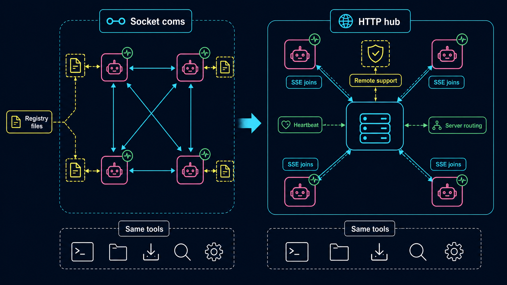

- **Task ID**: `build-meta-files`
- **Depends On**: `scout-net-context`
- **Assigned To**: `builder-meta`
- **Agent Type**: `general-purpose`
- **Parallel**: true (runs alongside server + client builders)
- `mkdir -p scripts/` if missing.
- In `extensions/themeMap.ts`, add `"coms-net": "ocean-breeze",` near the existing `"coms": "ocean-breeze"` entry (preserve neighboring comment style).
- In `justfile`, after the existing `ext-coms-team-4` recipe and before `#ext`, append:
  ```just
  # coms-net (HTTP/SSE hub)

  # Start a local coms-net server (binds 127.0.0.1, OS-claimed port)
  coms-net-server:
      bun scripts/coms-net-server.ts

  # Start a LAN-visible coms-net server (binds 0.0.0.0, requires PI_COMS_NET_AUTH_TOKEN)
  coms-net-server-lan:
      PI_COMS_NET_HOST=0.0.0.0 bun scripts/coms-net-server.ts

  # Pi with networked coms client (auto-discovers local server.json)
  ext-coms-net:
      pi -e extensions/coms-net.ts -e extensions/minimal.ts -e extensions/theme-cycler.ts
  ```
- Verify: `just --list | grep coms-net` shows three recipes; `grep '"coms-net"' extensions/themeMap.ts` shows the entry.

### 9. Spec-Compliance Review

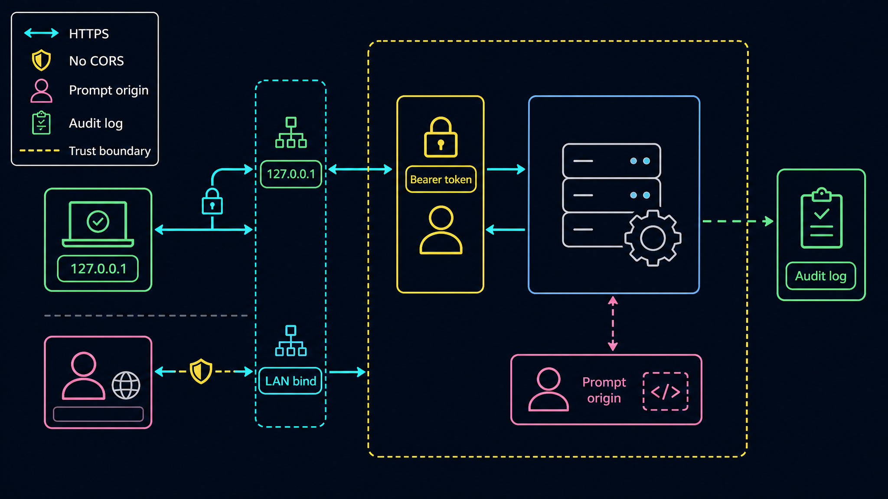

- **Task ID**: `review-impl-net`
- **Depends On**: `build-server-cleanup`, `build-client-widget`, `build-meta-files`
- **Assigned To**: `reviewer-net`
- **Agent Type**: `general-purpose`
- **Parallel**: false
- Run the static checklist (a–m) from the Reviewer role description.
- Verify every spec §9 endpoint is implemented and bearer-auth-protected.
- Verify all 11 SSE event names appear in the client dispatch (grep for each).
- Verify the auth token is never written into `server.json` or any logged line.
- Verify no auto-spawn server logic in client.
- Verify message TTL + stale loops exist on the server.
- Verify reconnect backoff is bounded.
- Verify widget key is `coms-net-pool` (not `coms-pool`) and audit channel is `coms-net-log` (not `coms-log`) so the new extension can never collide with old `coms.ts`.
- Output a pass/fail report with line numbers. On any FAIL, the orchestrator MUST resume the matching builder with the failure list. Cap retries at 2.

### 10. Validation: toolchain + import smoke + start/stop server + start/stop client

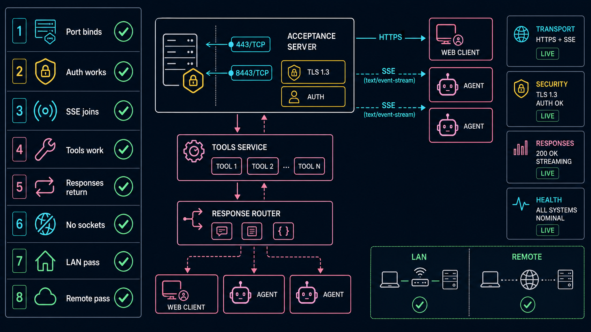

- **Task ID**: `validate-runtime-net`
- **Depends On**: `review-impl-net`
- **Assigned To**: `validator-net`
- **Agent Type**: `general-purpose`
- **Parallel**: false
- Run validation commands listed in §"Validation Commands" below in order.
- Capture each exit code and one-line summary.
- Final report: `READY` or `BLOCKED` with the failing command's output.

### 11. Server Wire Protocol Test (curl/fetch)


- **Task ID**: `test-server-protocol-net`
- **Depends On**: `validate-runtime-net`
- **Assigned To**: `tester-server-protocol`
- **Agent Type**: `general-purpose`
- **Parallel**: true (with `test-client-roundtrip-net`)
- Read `~/.claude/skills/drive/SKILL.md`.
- Pre-flight: `rm -rf ~/.pi/coms-net/projects/test-srv` only.
- Spawn tmux session `coms-net-srv-test` running `PI_COMS_NET_PROJECT=test-srv bun scripts/coms-net-server.ts`. Wait for it to print URL + token-path. Read `~/.pi/coms-net/projects/test-srv/server.json` for `local_url` and `~/.pi/coms-net/projects/test-srv/server.secret.json` for `token`.
- Write `/tmp/coms-net-server-test.mjs` covering all nine subtests from the Tester role description (T1–T9).
- Run `node /tmp/coms-net-server-test.mjs`. Capture full output.
- Cleanly Ctrl+C the server tmux session. Assert `~/.pi/coms-net/projects/test-srv/server.json` is gone.
- Final report: PASS/FAIL per subtest + cleanup state + READY or BLOCKED.

### 12. Client Roundtrip Test (drive, two Pi instances)


- **Task ID**: `test-client-roundtrip-net`
- **Depends On**: `validate-runtime-net`
- **Assigned To**: `tester-client-roundtrip`
- **Agent Type**: `general-purpose`
- **Parallel**: true (with `test-server-protocol-net`)
- Read `~/.claude/skills/drive/SKILL.md`.
- Pre-flight: `rm -rf ~/.pi/coms-net/projects/test-client` only.
- Create `specs/coms-net-v1/runtime/`.
- Spawn three tmux sessions:
  1. `coms-net-rt-srv` running `PI_COMS_NET_PROJECT=test-client bun scripts/coms-net-server.ts`. Capture `local_url` from `server.json` and `token` from `server.secret.json`.
  2. `coms-net-rt-A` running `pi -e extensions/coms-net.ts --name planner --color "#36F9F6" --project test-client --server-url <url> --auth-token <token>`.
  3. `coms-net-rt-B` similarly with `--name coder --color "#FF7EDB"`.
- Wait for both Pi sessions to show `📡 coms-net ready`. Wait additional 12 s for one heartbeat cycle.
- `drive screenshot` each Pi session → `specs/coms-net-v1/runtime/01-client-A.png`, `02-client-B.png`.
- `drive read --json --tail 200` each session, assert each capture contains:
  - `┏━` and `coms-net` (widget chrome present)
  - the OTHER agent's name (proves SSE pool propagation)
  - at least one `\x1b[38;2;` (proves color rendering)
  - `[####` `-` `]` `%` pattern (proves minimal footer survived — no `setFooter` clobber)
- Send `/coms-net` to A; screenshot again as `03-client-A-after-refresh.png`.
- Cleanly Ctrl+C all three sessions in reverse order (A, B, server). Assert `~/.pi/coms-net/projects/test-client/server.json` is gone.
- Final report: PASS/FAIL per assertion × per session + screenshot paths + READY or BLOCKED.

## Acceptance Criteria


- `scripts/coms-net-server.ts` exists and is between 500 and 1100 lines.
- `extensions/coms-net.ts` exists and is between 1200 and 1800 lines.
- Both files compile cleanly via Bun import smoke.
- `scripts/coms-net-server.ts` prints a URL on startup, writes `~/.pi/coms-net/projects/<project>/server.json` (no token), writes `server.secret.json` (`0600`) when token is auto-generated.
- `curl /health` returns `{ ok: true, version: 1, ... }` without auth.
- `curl /v1/agents` returns `401` without bearer; returns `200` with bearer.
- All nine spec §9 endpoints respond per spec.
- All 11 spec §11 SSE event names emitted by the server are handled by the client.
- `extensions/coms-net.ts` contains zero `setFooter` references.
- Widget key is exactly `"coms-net-pool"` and placement is `"belowEditor"`.
- Exactly four tools registered (`coms_net_list`, `coms_net_send`, `coms_net_get`, `coms_net_await`) and one slash command (`coms-net`).
- `pi.sendMessage` called with `deliverAs: "followUp"` and `customType: "coms-net-inbound"`.
- `pi.appendEntry("coms-net-log", …)` called for at least 6 distinct events.
- `extensions/themeMap.ts` contains `"coms-net": "ocean-breeze"`.
- `justfile` contains three recipes: `coms-net-server`, `coms-net-server-lan`, `ext-coms-net`.
- `package.json` is unchanged.
- Reviewer's checklist (a–m) returns full pass.
- Validator runtime report ends with `READY`.
- `tester-server-protocol` reports PASS on all nine subtests (T1–T9).
- `tester-client-roundtrip` reports PASS on all four visual assertions × both clients, plus three screenshots saved.
- After all tests, `ls ~/.pi/coms-net/projects/test-srv 2>/dev/null` and `ls ~/.pi/coms-net/projects/test-client 2>/dev/null` are empty.

## Validation Commands

Execute these commands to validate the task is complete:

- `bun --version` — confirm Bun present.
- `pi --version` — confirm Pi present.
- `test -f scripts/coms-net-server.ts && wc -l scripts/coms-net-server.ts` — server exists, 500–1100 lines.
- `test -f extensions/coms-net.ts && wc -l extensions/coms-net.ts` — client exists, 1200–1800 lines.
- `grep -n "setFooter" extensions/coms-net.ts || echo NO_SETFOOTER` — must print `NO_SETFOOTER`.
- `grep -nE 'setWidget\("coms-net-pool"' extensions/coms-net.ts` — must hit.
- `grep -nE 'placement:\s*"belowEditor"' extensions/coms-net.ts` — must hit.
- `grep -cE 'pi\.registerTool\(' extensions/coms-net.ts` — must return `4`.
- `grep -cE 'pi\.registerCommand\("coms-net"' extensions/coms-net.ts` — must return `1`.
- `grep -cE 'deliverAs:\s*"followUp"' extensions/coms-net.ts` — at least `1`.
- `grep -cE 'pi\.appendEntry\("coms-net-log"' extensions/coms-net.ts` — at least `6`.
- `grep -nE '"coms-net":\s*"ocean-breeze"' extensions/themeMap.ts` — one hit.
- `grep -E '^(coms-net-server|coms-net-server-lan|ext-coms-net):' justfile | wc -l` — must return `3`.
- `git diff package.json` — must be empty.
- `bun --silent -e "import('/Users/indydevdan/Documents/projects/experimental/pi-vs-cc/scripts/coms-net-server.ts').then(() => console.log('SERVER_OK'))"` — must print `SERVER_OK` and exit promptly. Requires the `if (import.meta.main) main()` guard in the server module; without it the import will hang because `Bun.serve` keeps the process alive.
- `bun --silent -e "import('/Users/indydevdan/Documents/projects/experimental/pi-vs-cc/extensions/coms-net.ts').then(m => console.log('CLIENT_OK', typeof m.default))"` — must print `CLIENT_OK function`.
- Server start/stop: `bun scripts/coms-net-server.ts &` (background), wait 2 s, `curl -fsS http://127.0.0.1:$(jq -r .port ~/.pi/coms-net/projects/default/server.json)/health`, `kill -INT %1`, wait 2 s, `test ! -f ~/.pi/coms-net/projects/default/server.json && test ! -f ~/.pi/coms-net/projects/default/server.secret.json && echo CLEAN` (both files must be cleaned up — secret only if server-generated, but that is the default for local mode).
- Client roundtrip: with the server running, `timeout 10 pi -e extensions/coms-net.ts -p "exit" >/dev/null 2>&1; echo $?` — must print `0`.

## Notes

- **No new dependencies.** Bun is the runtime for the server (already required by the project). The client uses native `fetch` + `ReadableStream` + `TextDecoder`. Hand-rolled SSE parser keeps the client dep-free.
- **Tool names are renamed for complete separation.** `coms_net_list/send/get/await` (not `coms_*`) so the two extensions can be loaded together without identifier collision. Slash command is `/coms-net`. Widget key `coms-net-pool`. Audit channel `coms-net-log`. CustomType `coms-net-inbound`. Registry root `~/.pi/coms-net/`. Recipes are still kept distinct (`ext-coms` for sockets, `ext-coms-net` for HTTP/SSE) as the typical mode of use, but stacking is now safe if anyone wants both.
- **Widget key, audit channel, customType all distinct.** `coms-net-pool` / `coms-net-log` / `coms-net-inbound` so the new extension never collides with anything from old `coms.ts` (in case both happen to be open in the system).
- **Auth token never logged.** Print only the path to `server.secret.json` on server boot, never the token. Strip from any error responses.
- **Server is mortal.** No PID files, no lock dirs, no daemon mode in v1. `Ctrl+C` is the only stop control. `server.json` is best-effort cleanup; agents tolerate stale `server.json` (they fail to connect, the user fixes it).
- **No auto-spawn from client.** If the extension can't find a server, it must `ctx.ui.notify(...)` with the exact `bun scripts/coms-net-server.ts` command and exit gracefully — never silently start one.
- **Reconnect is silent.** SSE drops happen on suspend/resume, network blips. Reconnect with backoff and log to `coms-net-log`, but don't notify the user unless the backoff hits the cap.
- **Out of scope (v2).** End-to-end encryption, multi-tenant hosted service, durable disk persistence, exactly-once delivery, partial-token streaming, browser dashboard, per-project tokens. All locked deferral per spec §3.
- **Open questions in spec §20 — locked per spec recommendations** unless the user overrides:
  1. Default bind `127.0.0.1`. ✓
  2. No auto-spawn server. ✓
  3. No disk persistence; in-memory + 30-min TTL. ✓
  4. No prompt-confirmation gate; surface origin. ✓
  5. One token per multi-project. ✓
  6. Tool names renamed to `coms_net_*` for complete separation; both extensions can stack without collision. ✓ (overrides spec recommendation per user direction "keep coms.ts and v1 work completely separate")
- **Retry budget.** If `review-impl-net` returns FAIL twice, the orchestrator pauses and surfaces the failure list to the user — don't loop indefinitely.
