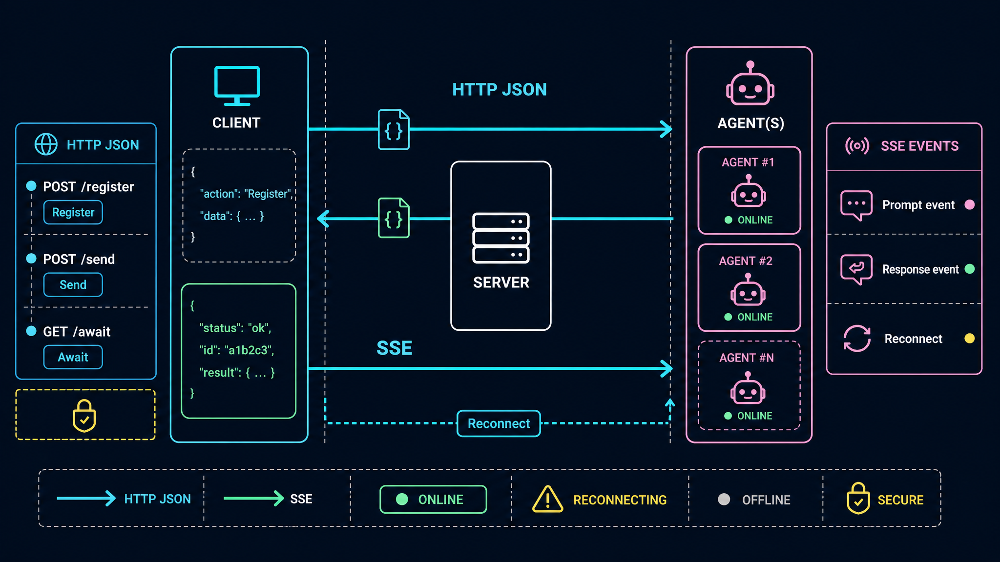

# `coms-net` — HTTP/SSE Pi Agent Communication Network

**Version:** 1.0 draft  
**Status:** planning spec  
**Scope:** redesign `coms` from local peer-to-peer sockets into a dedicated HTTP hub usable on localhost, LAN, or a remote URL  
**Implementation target:** Bun-powered HTTP server + Pi extension client  
**Important:** This document is a plan/spec only. Do not build implementation from this task.

---

<!-- vspec:hero -->

<!-- /vspec:hero -->

## 1. Purpose

<!-- vspec:image purpose -->

<!-- /vspec:image purpose -->


Current `extensions/coms.ts` lets multiple Pi agents on the same machine discover each other through files and communicate directly over Unix sockets / Windows named pipes. That is useful for single-machine demos, but it cannot naturally support:

- agents running on different machines on the same LAN,
- agents connecting through a remote server URL,
- one central view of all connected agents,
- server-pushed join/leave/status events,
- remote access from anywhere.

`coms-net` rebuilds the communication layer around a **dedicated HTTP server**. Agents no longer listen on per-agent sockets. Instead, every agent registers with a shared hub, keeps an SSE event stream open, and sends/receives messages through HTTP endpoints.

The high-level shape becomes:

```text
┌────────────┐       HTTP JSON        ┌────────────────────┐       SSE events       ┌────────────┐
│ planner Pi │  ───────────────────▶  │ Bun coms-net hub   │  ───────────────────▶ │ coder Pi   │
│ agent      │  ◀───────────────────  │ LAN / remote URL   │  ◀─────────────────── │ agent      │
└────────────┘        SSE/HTTP         └────────────────────┘       HTTP JSON        └────────────┘
```

The hub is responsible for:

- binding a configured host and claiming an open port when running locally,
- advertising the claimed URL for local agents,
- accepting agent registration,
- maintaining the live agent pool,
- pushing join/leave/update events over SSE,
- routing prompts and responses,
- maintaining pending message state,
- supporting remote operation behind a public HTTPS URL.

---

## 2. Design goals

<!-- vspec:image design-goals -->

<!-- /vspec:image design-goals -->


1. **Dedicated server, not peer sockets.**  
   All agent-to-agent communication goes through a Bun HTTP server.

2. **Local by default, LAN/remote capable.**  
   The same protocol works against:
   - an explicitly started local server,
   - a LAN server bound to `0.0.0.0`,
   - a fully remote HTTPS server URL.

3. **Simple port claiming.**  
   The server binds once and lets Bun/OS claim the actual port. No startup locks, no hidden auto-spawn coordination, and no port-scanning protocol in v1.

4. **Preserve existing coms capabilities (with renamed identifiers for hard separation from v1).**  
   Keep the conceptual behavior of:
   - `coms_net_list` (v1: `coms_list`),
   - `coms_net_send` (v1: `coms_send`),
   - `coms_net_get` (v1: `coms_get`),
   - `coms_net_await` (v1: `coms_await`),
   - pool widget (key `coms-net-pool`, v1: `coms-pool`),
   - inbound prompt injection (`customType: "coms-net-inbound"`, v1: `coms-inbound`),
   - response capture on `agent_end`,
   - hop limits,
   - identity cards,
   - audit logging (channel `coms-net-log`, v1: `coms-log`).
   
   Renamed identifiers let `extensions/coms.ts` and `extensions/coms-net.ts` coexist in the same Pi process without tool-name, widget-key, or audit-channel collisions.

5. **SSE for server-pushed events.**  
   Agents maintain an SSE stream. The server pushes:
   - pool snapshots,
   - `agent_joined`,
   - `agent_left`,
   - `agent_updated`,
   - inbound prompts,
   - responses,
   - message status updates.

6. **HTTP JSON for commands.**  
   Registration, heartbeats, sends, responses, and polling use normal JSON endpoints.

7. **No direct LAN trust.**  
   Even on LAN, use bearer-token authentication. Prompts can cause agents to run tools, so unauthenticated network access is dangerous.

8. **Implementation remains simple.**  
   Use Bun for the server. Use built-in `fetch`/stream parsing in the Pi extension client. Avoid WebSocket unless a future version needs bidirectional streaming.

---

## 3. Non-goals for v1

- End-to-end encryption between agents.
- Multi-tenant public hosted service with account management.
- Durable database-backed message persistence.
- Exactly-once delivery semantics.
- Streaming partial assistant tokens between agents.
- Browser UI dashboard.
- Replacing Pi sessions or subagent orchestration.
- Implementing this spec during this task.

---

## 4. Recommended target files

This spec intentionally separates the new network design from the existing `coms.ts` socket version.

Recommended implementation files for a future build:

```text
extensions/coms-net.ts          # Pi extension client: tools, SSE client, widget, Pi hooks
scripts/coms-net-server.ts      # Bun HTTP/SSE hub server
specs/coms-net-v1.md            # this spec
```

The client should mirror the current `extensions/coms.ts` implementation style where possible: extension CLI flags are declared via `pi.registerFlag`, values are read with `pi.getFlag`, agent names are resolved to unique live names, and the pool UI remains a stackable below-editor widget rather than a footer replacement.

Optional future compatibility path:

- Keep `extensions/coms.ts` as the socket/P2P implementation.
- Add `extensions/coms-net.ts` as the networked HTTP implementation.
- Later, if `coms-net` becomes the default, `extensions/coms.ts` can become a thin wrapper or be replaced.

Suggested future `justfile` entries:

```just
# Start a local coms-net server and claim an open port
coms-net-server:
    bun scripts/coms-net-server.ts

# Start a LAN-visible coms-net server and claim an open port
coms-net-server-lan:
    PI_COMS_NET_HOST=0.0.0.0 bun scripts/coms-net-server.ts

# Pi with networked coms client
ext-coms-net:
    pi -e extensions/coms-net.ts -e extensions/minimal.ts -e extensions/theme-cycler.ts
```

---

## 5. Deployment modes

<!-- vspec:image deployment-modes -->

<!-- /vspec:image deployment-modes -->


### 5.1 Local server mode

Default developer mode.

The server is an explicit process. Start it first:

```bash
bun scripts/coms-net-server.ts
```

By default the server binds `127.0.0.1` and asks Bun/OS to claim an open port (`PI_COMS_NET_PORT=0`). On startup it prints the selected URL and writes it to the local server registry file for convenience.

Agents connect in either of two simple ways:

```bash
# Explicit URL via environment, most predictable
PI_COMS_NET_SERVER_URL=http://127.0.0.1:<claimed-port> just ext-coms-net

# Explicit URL via Pi/extension CLI flag
pi -e extensions/coms-net.ts --server-url http://127.0.0.1:<claimed-port> --name planner

# Or, if no server URL is provided, the extension may read the latest
# local server registry file for the current project and connect to that URL.
just ext-coms-net
```

If no explicit URL is provided and no healthy local server registry exists, the extension should fail clearly and ask the user to start the server. It should **not** auto-spawn a server in v1.

### 5.2 LAN mode

The server binds to a LAN-visible interface:

```bash
PI_COMS_NET_HOST=0.0.0.0 \
PI_COMS_NET_PUBLIC_URL=http://192.168.1.25:<port> \
bun scripts/coms-net-server.ts
```

Agents on other machines connect with:

```bash
PI_COMS_NET_SERVER_URL=http://192.168.1.25:<port> \
PI_COMS_NET_AUTH_TOKEN=<token> \
pi -e extensions/coms-net.ts

# Equivalent CLI-flag form
pi -e extensions/coms-net.ts \
  --server-url http://192.168.1.25:<port> \
  --auth-token <token>
```

### 5.3 Remote server mode

A hosted Bun server runs behind HTTPS, e.g. behind Caddy, nginx, Fly.io, Render, or a VPS.

Agents connect from anywhere:

```bash
PI_COMS_NET_SERVER_URL=https://coms.example.com \
PI_COMS_NET_AUTH_TOKEN=<token> \
PI_COMS_NET_PROJECT=my-project \
pi -e extensions/coms-net.ts

# Equivalent CLI-flag form
pi -e extensions/coms-net.ts \
  --server-url https://coms.example.com \
  --auth-token <token> \
  --project my-project
```

Remote mode should not depend on local registry files. The server URL and auth token are explicit, supplied either by environment variables or CLI flags.

---

## 6. Local port claiming and server discovery

<!-- vspec:image port-claiming -->

<!-- /vspec:image port-claiming -->


### 6.1 Server bind behavior

The Bun server should support:

```text
PI_COMS_NET_HOST          default: 127.0.0.1
PI_COMS_NET_PORT          default: 0        # 0 means ask Bun/OS for an open port
PI_COMS_NET_PUBLIC_URL    optional explicit advertised URL
PI_COMS_NET_PROJECT       default: default
PI_COMS_NET_AUTH_TOKEN    optional for local; required for LAN/remote
```

When `PI_COMS_NET_PORT=0`, Bun asks the OS for an open port and claims it atomically as part of `Bun.serve()`:

```ts
const server = Bun.serve({
  hostname: host,
  port: requestedPort,
  fetch(req) { /* router */ },
});

const claimedPort = server.port;
const localUrl = `http://${host === "0.0.0.0" ? "127.0.0.1" : host}:${claimedPort}`;
```

There is no separate port scan. The bind itself is the claim.

If `PI_COMS_NET_PORT` is set to a fixed port and that port is already taken, the server should fail with a clear error and suggest either stopping the existing server or using `PI_COMS_NET_PORT=0`/another port.

### 6.2 Server registry file

After the explicit server process successfully binds, it writes the selected URL for local discovery:

```text
~/.pi/coms-net/projects/<project>/server.json
```

Example:

```json
{
  "version": 1,
  "project": "default",
  "pid": 54231,
  "host": "127.0.0.1",
  "port": 49152,
  "local_url": "http://127.0.0.1:49152",
  "public_url": "http://192.168.1.25:49152",
  "started_at": "2026-05-07T12:34:56.000Z"
}
```

The registry is only a convenience pointer to the currently running local server. It is not a distributed lock and it is not the source of truth for remote deployments.

Do **not** write the full auth token into `server.json`. For local development, either:

- store a generated token in `server.secret.json` with `0600` permissions, or
- require `PI_COMS_NET_AUTH_TOKEN` if the server binds to a LAN-visible address.

### 6.3 No startup lock or auto-spawn in v1

The v1 model is intentionally simple:

1. The user starts exactly one server process.
2. The server claims an open port.
3. The server prints and optionally records the URL.
4. Agents connect to that URL.

The Pi extension should not coordinate server startup, create lock directories, or spawn a hidden server process in v1. If it cannot find a healthy server, it should tell the user how to start one.

---

## 7. Protocol choice

<!-- vspec:image protocol-choice -->

<!-- /vspec:image protocol-choice -->


### Chosen protocol: HTTP JSON + SSE

Use:

- **HTTP JSON requests** for client-to-server operations.
- **Server-Sent Events** for server-to-agent notifications.

Why SSE over WebSocket for v1:

- Simple one-way server push is enough.
- Works well through proxies.
- Easy to inspect with curl.
- Reconnect semantics are straightforward.
- Commands can remain normal POST/GET requests.
- No additional dependency required.

Future versions can add WebSocket if token streaming or true bidirectional low-latency RPC becomes important.

---

## 8. Agent identity

<!-- vspec:image agent-identity -->

<!-- /vspec:image agent-identity -->


Each Pi extension client generates or resolves an agent card.

```ts
type AgentCard = {
  session_id: string;
  name: string;
  purpose: string;
  model: string;
  provider?: string;
  color: string;
  cwd: string;
  project: string;
  explicit: boolean;
  started_at: string;
  context_used_pct: number;
  queue_depth: number;
  status: "online" | "stale" | "offline";
};
```

Identity/config sources, in priority order:

1. CLI flags parsed by the extension, e.g. `--name`, `--purpose`, `--project`, `--color`, `--explicit`, `--server-url`, `--auth-token`.
2. Environment variables, e.g. `PI_COMS_NET_PROJECT`, `PI_COMS_NET_SERVER_URL`, `PI_COMS_NET_AUTH_TOKEN`.
3. System prompt / agent frontmatter, if launched with a persona file.
4. Defaults:
   - `name = agent-<session suffix>`
   - `project = default`
   - deterministic fallback color.

CLI flag examples:

```bash
pi -e extensions/coms-net.ts \
  --name planner \
  --purpose "planning agent" \
  --project default \
  --server-url http://127.0.0.1:49152 \
  --auth-token <token>
```

Resolution rules:

- CLI flags override environment variables.
- Environment variables override frontmatter/defaults.
- `--server-url` is equivalent to `PI_COMS_NET_SERVER_URL`.
- `--auth-token` is equivalent to `PI_COMS_NET_AUTH_TOKEN`.
- Do not print the raw auth token in notifications, logs, widgets, or manifests.

Name collisions:

- `session_id` is always unique and authoritative.
- `name` is a human-friendly alias, but the UI should avoid ambiguous duplicate names.
- Match the current socket `coms` behavior: on registration, scan the project's live entries and resolve a unique display/registry name by appending the smallest free integer >= 2 (`planner` → `planner2` → `planner3`).
- The resolved name flows through to the server agent record, pool widget, status-line label, boot notification, message sender label, and audit log.
- Record collisions as `event: "name_collision"` in `coms-net-log` with `desired`, `assigned`, and `project` fields.

---

## 9. HTTP API

<!-- vspec:image http-api -->

<!-- /vspec:image http-api -->


All `/v1/*` endpoints require:

```http
Authorization: Bearer <token>
Content-Type: application/json
```

SSE also requires auth, either by header or by signed query token. Prefer headers when the client is a Pi extension using `fetch`.

### 9.1 Health

```http
GET /health
```

Response:

```json
{
  "ok": true,
  "version": 1,
  "server_id": "01HX...",
  "started_at": "2026-05-07T12:34:56.000Z"
}
```

### 9.2 Register agent

```http
POST /v1/agents/register
```

Request:

```json
{
  "project": "default",
  "session_id": "01HXAGENT...",
  "name": "planner",
  "purpose": "Plans implementation work",
  "model": "claude-sonnet-4-7",
  "provider": "anthropic",
  "color": "#36F9F6",
  "cwd": "/Users/dan/project",
  "explicit": false
}
```

Response:

```json
{
  "ok": true,
  "agent": { "...": "AgentCard" },
  "heartbeat_interval_ms": 10000,
  "sse_url": "/v1/events?project=default&session_id=01HXAGENT..."
}
```

Server behavior:

- Inserts/updates the agent card.
- Marks status `online`.
- Emits `agent_joined` to other agents in the project.
- Emits `pool_snapshot` to the registering agent after SSE connects.

### 9.3 Open event stream

```http
GET /v1/events?project=<project>&session_id=<session_id>
Accept: text/event-stream
```

The server keeps this connection open and writes SSE frames:

```text
event: pool_snapshot
id: 42
data: {"agents":[...]}

```

Recommended SSE event names:

```text
hello
pool_snapshot
agent_joined
agent_updated
agent_stale
agent_left
prompt
response
message_status
server_ping
error
```

`server_ping` can be sent as either a normal event or an SSE comment:

```text
: ping 2026-05-07T12:34:56.000Z

```

### 9.4 Heartbeat/update card

```http
POST /v1/agents/:session_id/heartbeat
```

Request:

```json
{
  "project": "default",
  "context_used_pct": 34,
  "queue_depth": 1,
  "model": "claude-sonnet-4-7",
  "status": "online"
}
```

Response:

```json
{ "ok": true }
```

Server behavior:

- Updates `last_seen_at`.
- Updates dynamic card fields.
- Emits `agent_updated` if visible values changed.

### 9.5 List agents

```http
GET /v1/agents?project=default&include_explicit=false
```

Response:

```json
{
  "agents": [
    {
      "session_id": "01HX...",
      "name": "planner",
      "purpose": "Plans work",
      "model": "claude-sonnet-4-7",
      "color": "#36F9F6",
      "context_used_pct": 34,
      "queue_depth": 0,
      "status": "online"
    }
  ]
}
```

### 9.6 Send prompt

```http
POST /v1/messages
```

Request:

```json
{
  "project": "default",
  "sender_session": "01HXSENDER...",
  "target": "coder",
  "target_session": null,
  "prompt": "Review this file for bugs",
  "conversation_id": null,
  "response_schema": null,
  "hops": 0
}
```

Response:

```json
{
  "ok": true,
  "msg_id": "01HXMSG...",
  "status": "queued",
  "target_session": "01HXTARGET..."
}
```

Server behavior:

1. Resolves target by `target_session` or unambiguous `target` name.
2. Enforces hop limit.
3. Creates message record.
4. Queues prompt to target inbox.
5. Immediately emits SSE `prompt` to target if connected.
6. Emits `message_status` to sender.

If the target is unknown, offline beyond queue TTL, or ambiguous, return `404`/`409` with a structured error.

### 9.7 Get message status

```http
GET /v1/messages/:msg_id
```

Response:

```json
{
  "msg_id": "01HXMSG...",
  "status": "queued" | "delivered" | "complete" | "error" | "timeout",
  "response": null,
  "error": null
}
```

### 9.8 Await message response

```http
GET /v1/messages/:msg_id/await?timeout_ms=30000
```

The server holds the request until the response is complete or timeout fires.

Response on completion:

```json
{
  "msg_id": "01HXMSG...",
  "status": "complete",
  "response": "Found three issues...",
  "error": null
}
```

Response on timeout:

```json
{
  "msg_id": "01HXMSG...",
  "status": "timeout",
  "response": null,
  "error": "timeout"
}
```

### 9.9 Submit response

```http
POST /v1/messages/:msg_id/response
```

Request:

```json
{
  "project": "default",
  "responder_session": "01HXTARGET...",
  "response": "Found three issues...",
  "error": null
}
```

Server behavior:

- Marks message `complete` or `error`.
- Stores response in memory until TTL expiry.
- Emits SSE `response` to sender if connected.
- Releases any `/await` request waiting on this message.

### 9.10 Unregister agent

```http
DELETE /v1/agents/:session_id?project=default
```

Server behavior:

- Marks the agent offline.
- Closes its SSE stream if still open.
- Emits `agent_left` to the project pool.

---

## 10. Message model

<!-- vspec:image message-model -->

<!-- /vspec:image message-model -->


```ts
type ComsMessage = {
  msg_id: string;
  project: string;
  sender_session: string;
  target_session: string;
  prompt: string;
  conversation_id: string | null;
  response_schema: object | null;
  hops: number;
  status: "queued" | "delivered" | "complete" | "error" | "timeout";
  response?: any;
  error?: string | null;
  created_at: string;
  delivered_at?: string;
  completed_at?: string;
  expires_at: string;
};
```

Server keeps messages in memory for v1.

Recommended defaults:

```text
PI_COMS_NET_MAX_HOPS=5
PI_COMS_NET_MESSAGE_TTL_MS=1800000      # 30 min
PI_COMS_NET_MAX_INBOX=100              # per target
PI_COMS_NET_HEARTBEAT_MS=10000
PI_COMS_NET_STALE_AFTER_MS=30000
PI_COMS_NET_OFFLINE_AFTER_MS=60000
```

---

## 11. SSE payloads

<!-- vspec:image sse-payloads -->

<!-- /vspec:image sse-payloads -->


### `pool_snapshot`

Sent after an agent opens SSE and whenever `/coms-net` force-refreshes.

```json
{
  "project": "default",
  "agents": [
    { "session_id": "...", "name": "planner", "status": "online" }
  ]
}
```

### `agent_joined`

```json
{
  "project": "default",
  "agent": { "session_id": "...", "name": "coder", "status": "online" }
}
```

### `agent_updated`

```json
{
  "project": "default",
  "agent": { "session_id": "...", "context_used_pct": 42, "queue_depth": 1 }
}
```

### `agent_left`

```json
{
  "project": "default",
  "session_id": "01HX...",
  "name": "coder",
  "reason": "shutdown" | "stale" | "connection_closed"
}
```

### `prompt`

```json
{
  "msg_id": "01HXMSG...",
  "project": "default",
  "sender": { "session_id": "...", "name": "planner", "cwd": "/repo" },
  "prompt": "Review this file",
  "conversation_id": null,
  "response_schema": null,
  "hops": 0
}
```

### `response`

```json
{
  "msg_id": "01HXMSG...",
  "project": "default",
  "responder": { "session_id": "...", "name": "coder" },
  "response": "Found three issues...",
  "error": null,
  "status": "complete"
}
```

### `message_status`

```json
{
  "msg_id": "01HXMSG...",
  "status": "delivered"
}
```

---

## 12. Pi extension client lifecycle

<!-- vspec:image client-lifecycle -->

<!-- /vspec:image client-lifecycle -->


### 12.1 `session_start`

Future `extensions/coms-net.ts` should:

1. Register extension CLI flags at top level of the default export using `pi.registerFlag` so Pi accepts them before session hooks run: `name`, `purpose`, `project`, `color`, `explicit`, `server-url`, `auth-token`.
2. Call `applyExtensionDefaults(import.meta.url, ctx)`.
3. Resolve identity: desired name, purpose, project, explicit, color.
4. Resolve the final unique live agent name using the same suffixing behavior as socket `coms`.
5. Resolve server URL, in priority order:
   - CLI flag `--server-url <url>`, or
   - environment variable `PI_COMS_NET_SERVER_URL`, or
   - healthy local `server.json` written by an explicitly started server.
6. If no server URL is available, stop with a clear message telling the user to start `bun scripts/coms-net-server.ts`.
7. Resolve auth token, in priority order:
   - CLI flag `--auth-token <token>`, or
   - environment variable `PI_COMS_NET_AUTH_TOKEN`, or
   - local development token file if supported by the server registry.
8. Register agent with `POST /v1/agents/register` using the final unique name.
9. Open SSE stream with `GET /v1/events`.
10. Install pool widget from server snapshot.
11. Start heartbeat interval using `ctx.getContextUsage()` and inbound queue depth.
12. Set status with the compact current style: `ctx.ui.setStatus("coms-net", `📡 ${name}@${project}`)`.
13. Notify boot summary with server URL and project, but never print the raw auth token.

### 12.2 SSE event handling

The extension should parse SSE frames from a streaming `fetch` response.

No dependency is required; implement a small parser:

- buffer chunks with `TextDecoder`,
- split events on blank line,
- parse `event:`, `id:`, and `data:` lines,
- JSON.parse the data field,
- dispatch by event type.

On disconnect:

1. Mark connection state as reconnecting.
2. Exponential backoff up to 10 seconds.
3. Reconnect with last seen event id if the server supports it.
4. On reconnect, ask for fresh `pool_snapshot`.

### 12.3 Inbound prompt delivery

On SSE `prompt` event:

1. Store inbound context keyed by `msg_id`.
2. Mark server message `delivered` if needed.
3. Inject as Pi follow-up:

```ts
pi.sendMessage(
  {
    customType: "coms-net-inbound",
    content: `[from ${sender.name} @ ${sender.cwd}]\n\n${prompt}`,
    display: true,
    details: { msg_id, sender_session: sender.session_id, response_schema, hops },
  },
  { deliverAs: "followUp", triggerTurn: true },
);
```

This preserves the current `coms` behavior: inbound prompts become queued, non-interrupting follow-up turns.

### 12.4 Response capture on `agent_end`

On `agent_end`:

1. Find the most recent unfulfilled inbound `msg_id`.
2. Walk `ctx.sessionManager.getBranch()` and extract final assistant text.
3. If `response_schema` exists, parse/validate response as JSON.
4. Submit response:

```http
POST /v1/messages/:msg_id/response
```

5. Clear inbound context.

### 12.5 Shutdown

On `session_shutdown`, `SIGINT`, or `SIGTERM`:

1. Stop heartbeat.
2. Close SSE stream.
3. Send `DELETE /v1/agents/:session_id` best-effort.
4. Append `pi.appendEntry("coms-net-log", { event: "shutdown", ... })`.
5. Do not stop the server from the extension in v1. The server is an explicit process with its own lifecycle.

---

## 13. Preserved tool surface

<!-- vspec:image tool-surface -->

<!-- /vspec:image tool-surface -->


Keep the user/agent-facing tools close to current `coms`.

### `coms_net_list`

Parameters:

```ts
{
  project?: string;              // default current project
  include_explicit?: boolean;    // default false
}
```

Implementation:

```http
GET /v1/agents?project=<project>&include_explicit=<bool>
```

Returns live server cards; no peer pinging required.

### `coms_net_send`

Parameters:

```ts
{
  target: string;                // agent name or session_id
  prompt: string;
  conversation_id?: string;
  response_schema?: object;
}
```

Implementation:

```http
POST /v1/messages
```

Returns `msg_id` immediately after server accepts/queues the message.

### `coms_net_get`

Parameters:

```ts
{ msg_id: string }
```

Implementation:

```http
GET /v1/messages/:msg_id
```

Non-blocking status poll.

### `coms_net_await`

Parameters:

```ts
{
  msg_id: string;
  timeout_ms?: number;
}
```

Implementation options:

1. Prefer server endpoint:
   ```http
   GET /v1/messages/:msg_id/await?timeout_ms=<n>
   ```
2. Or wait for local SSE `response` event if already connected.

Use server await for simpler semantics and remote reliability.

### `/coms-net`

Slash command behavior (registered as `coms-net` to avoid colliding with v1's `/coms`):

```text
/coms-net                         refresh local pool snapshot
/coms-net --all                   include explicit agents in widget/list
/coms-net --project <name>        switch displayed project
/coms-net --server                show server URL/health summary
/coms-net --reconnect             close and reopen SSE stream
```

---

## 14. Pool widget behavior

<!-- vspec:image pool-widget -->

<!-- /vspec:image pool-widget -->


The pool widget remains the primary visual surface.

Widget key:

```ts
ctx.ui.setWidget("coms-net-pool", ..., { placement: "belowEditor" })
```

Do **not** use `setFooter`; it must stack with `minimal.ts`, `tool-counter.ts`, and other footer extensions.

Reference screenshot from the current socket `coms` implementation:


Suggested rendering should mirror the current `extensions/coms.ts` styling updates: a bordered block with a branded top border, the local agent name embedded in the top-right tag using the local agent color, and a plain bottom rule. Example body rows:

```text
┏━ coms-net ━━━━━━━━━━━━━━━━━━━━━━━━━━━━━━━━━ planner ━┓
 ● coder        sonnet-4      [######---------] 41%  —  Writes code
 ● reviewer     opus          [##-------------] 12%  —  Reviews plans
┗━━━━━━━━━━━━━━━━━━━━━━━━━━━━━━━━━━━━━━━━━━━━━━━━━━━━━━━┛
```

Empty pool:

```text
┏━ coms-net ━━━━━━━━━━━━━━━━━━━━━━━━━━━━━━━━━ planner ━┓
 no peers connected
┗━━━━━━━━━━━━━━━━━━━━━━━━━━━━━━━━━━━━━━━━━━━━━━━━━━━━━━━┛
```

Color conventions:

- top/bottom borders use `dim`, with the `coms-net` brand segment in `border`, matching the socket `coms` bordered-widget style,
- local agent name in the top border uses the local agent's hex color,
- peer swatch and filled context bar use peer hex color,
- `accent` for peer names and percentages,
- `warning` for context-bar brackets,
- `dim` for model labels, separators, stale rows, and empty bar fill,
- `muted` for purpose,
- never use `setFooter`; this remains a below-editor widget only.

Widget updates are event-driven:

- `pool_snapshot` replaces local cache,
- `agent_joined` inserts,
- `agent_updated` patches,
- `agent_left` marks offline/removes,
- heartbeat responses are not needed for widget refresh because updates arrive via SSE,
- render from an in-memory cache only; do not perform filesystem or network work inside the widget render closure.

---

## 15. Server internals

<!-- vspec:image server-internals -->

<!-- /vspec:image server-internals -->


### 15.1 In-memory state

```ts
type ServerState = {
  server_id: string;
  started_at: string;
  projects: Map<string, ProjectState>;
};

type ProjectState = {
  agents: Map<string, AgentRecord>;      // session_id -> record
  nameIndex: Map<string, Set<string>>;   // name -> session_ids
  messages: Map<string, ComsMessage>;
  streams: Map<string, SseClient>;       // session_id -> stream writer
  awaiters: Map<string, Set<Awaiter>>;   // msg_id -> pending HTTP await responses
};
```

### 15.2 Agent staleness

The server periodically scans agents:

- if `now - last_seen_at > STALE_AFTER_MS`, mark stale and emit `agent_stale`,
- if `now - last_seen_at > OFFLINE_AFTER_MS`, mark offline and emit `agent_left`,
- if SSE connection closes, mark stale immediately unless heartbeats continue.

### 15.3 Message TTL cleanup

Periodic cleanup:

- expire old queued messages,
- expire completed messages after TTL,
- release awaiters with timeout/error,
- cap inbox sizes.

---

## 16. Security model

<!-- vspec:image security-model -->

<!-- /vspec:image security-model -->


### 16.1 Authentication

Every request must include:

```http
Authorization: Bearer <token>
```

Local mode can generate a random token. LAN and remote modes should require explicit `PI_COMS_NET_AUTH_TOKEN`.

### 16.2 Bind defaults

Recommended defaults:

- auto local server: bind `127.0.0.1`, safest for single-machine use,
- explicit LAN server: bind `0.0.0.0`, require token,
- remote server: require HTTPS and token.

Even though the feature aims to support LAN, avoid accidentally exposing a prompt-routing server without auth.

### 16.3 Prompt trust boundary

A remote prompt can cause an agent to use tools. Therefore:

- display sender name/cwd/project in inbound prompt,
- include source metadata in `details`,
- log all inbound/outbound messages with `pi.appendEntry("coms-net-log", ...)`,
- optionally support an `explicit` mode where agents are hidden unless targeted directly,
- consider a future confirmation gate for cross-project or remote senders.

### 16.4 CORS

CORS should be disabled by default. This is an agent protocol, not a browser API.

If a future dashboard is added, configure CORS explicitly.

---

## 17. Differences from socket `coms` v1

<!-- vspec:image differences -->

<!-- /vspec:image differences -->


| Capability | Current `coms` | New `coms-net` |
|---|---|---|
| Discovery | filesystem registry per agent | HTTP server registry/in-memory pool |
| Transport | Unix socket / named pipe per agent | HTTP JSON + SSE via central hub |
| Peer liveness | direct ping socket | heartbeat + SSE connection state |
| Join notification | polling/ping widget | server-pushed `agent_joined` |
| Remote support | no | yes, via server URL |
| LAN support | no | yes, bind server to LAN IP/0.0.0.0 |
| Message routing | sender connects to target endpoint | sender POSTs to server; server emits to target |
| Response routing | target connects back to sender endpoint | target POSTs response to server; server emits to sender |
| Port/socket cleanup | per-agent socket files | one server process/port |
| Tool surface | `coms_list/send/get/await` | same conceptual tools |

---

## 18. Implementation plan

<!-- vspec:image implementation-plan -->

<!-- /vspec:image implementation-plan -->


Again: this is a plan only. Do not build during this task.

### Phase 1 — Finalize protocol and target files

Deliverables:

- Confirm target file names.
- Decide whether future extension is `extensions/coms-net.ts` or replacement `extensions/coms.ts`.
- Confirm local server registry path.
- Confirm environment variable names and default port behavior.

Acceptance:

- This spec is accepted as source of truth.

### Phase 2 — Build Bun hub server

Future implementation tasks:

1. Create `scripts/coms-net-server.ts`.
2. Implement `Bun.serve` router.
3. Implement auth middleware.
4. Implement state maps by project.
5. Implement endpoints:
   - `/health`,
   - `/v1/agents/register`,
   - `/v1/events`,
   - `/v1/agents/:id/heartbeat`,
   - `/v1/agents`,
   - `/v1/messages`,
   - `/v1/messages/:id`,
   - `/v1/messages/:id/await`,
   - `/v1/messages/:id/response`,
   - `DELETE /v1/agents/:id`.
6. Implement SSE writer helper.
7. Implement heartbeat/stale cleanup loop.
8. Implement message TTL cleanup loop.
9. Implement local server registry write on startup.

Acceptance:

- `bun scripts/coms-net-server.ts` claims an open port and prints the selected URL.
- `GET /health` succeeds.
- Register/list/heartbeat APIs work with curl.
- SSE stream receives `hello` and `pool_snapshot`.

### Phase 3 — Build Pi extension client

Future implementation tasks:

1. Create `extensions/coms-net.ts`.
2. Register same four tools:
   - `coms_list`,
   - `coms_send`,
   - `coms_get`,
   - `coms_await`.
3. Register `/coms` command.
4. Implement local/remote server resolution.
5. Implement `pi.registerFlag` / `pi.getFlag` handling for `--name`, `--purpose`, `--project`, `--color`, `--explicit`, `--server-url`, and `--auth-token`.
6. If no healthy server is found, report a clear startup instruction instead of auto-starting.
7. Implement unique-name resolution before registration.
8. Implement agent registration.
9. Implement fetch-stream SSE parser.
10. Implement prompt event injection with `pi.sendMessage(... followUp ...)`.
11. Implement `agent_end` response capture.
12. Implement heartbeat loop.
13. Implement the bordered below-editor pool widget with local-name top-border tag and socket `coms` color conventions.
14. Implement shutdown unregister.

Acceptance:

- One Pi instance starts and registers.
- Two Pi instances connected to same hub see each other without polling.
- `coms_send` from A reaches B as follow-up.
- B's `agent_end` response returns to A.
- `coms_await` resolves.

### Phase 4 — Tests

Server-level tests:

- Health endpoint.
- Auth required.
- Register/list.
- SSE hello/snapshot.
- Join event delivered to existing client.
- Prompt event delivered to target.
- Response event delivered to sender.
- Await endpoint releases on response.
- Heartbeat stale/offline transition.
- Hop limit rejection.

Extension-level smoke tests:

- `bun --version`.
- `pi --version`.
- import extension module.
- launch server + one Pi with `-p "exit"`.
- two interactive Pi sessions connected to same local server.

LAN test:

- Start server with `PI_COMS_NET_HOST=0.0.0.0`.
- Connect one agent from another machine using `PI_COMS_NET_SERVER_URL`.
- Verify pool join event and message round-trip.

Remote test:

- Run server behind HTTPS.
- Connect agents from two networks.
- Verify message round-trip and reconnect behavior.

### Phase 5 — Documentation and recipes

Future docs/recipe updates:

- Add `just coms-net-server`.
- Add `just coms-net-server-lan`.
- Add `just ext-coms-net`.
- Add README section explaining local/LAN/remote modes.
- Add security warning for exposing the server.
- Add troubleshooting section for auth, ports, SSE reconnects.

---

## 19. Acceptance criteria for finished future implementation

<!-- vspec:image acceptance -->

<!-- /vspec:image acceptance -->


A future implementation is complete when:

1. `scripts/coms-net-server.ts` runs with Bun and claims an open port by default.
2. Local server mode writes a valid `server.json` with the claimed port.
3. Pi agents do not auto-spawn hidden server processes in v1; they connect to an explicit server URL or local registry entry.
4. Remote mode works with either `PI_COMS_NET_SERVER_URL`/`PI_COMS_NET_AUTH_TOKEN` environment variables or `--server-url`/`--auth-token` CLI flags.
5. Every `/v1/*` endpoint requires bearer auth.
6. Agents receive `agent_joined` over SSE when another agent registers.
7. Agents receive `agent_left` or `agent_stale` without manual refresh.
8. The pool widget updates from SSE events.
9. `coms_list` returns the server-side live pool.
10. `coms_send` returns `msg_id` after server queues the prompt.
11. Target agent receives prompt as Pi follow-up message.
12. Target response is captured on `agent_end` and posted to server.
13. Sender receives response through SSE and/or `coms_await`.
14. Hop limit is enforced by the server.
15. Message TTL cleanup prevents unbounded memory growth.
16. No Unix socket or named pipe is used for agent-to-agent delivery.
17. Existing UI stacking rule is preserved: no `setFooter` in `coms-net`; the bordered pool block is rendered with `setWidget(..., { placement: "belowEditor" })`.
18. LAN test passes between two machines on same network.
19. Remote HTTPS test passes between two machines on different networks.

---

## 20. Open design questions

Resolve before implementation:

1. Should local server bind `127.0.0.1` by default, with LAN requiring explicit `PI_COMS_NET_HOST=0.0.0.0`?  
   Recommendation: yes, safer default.

2. Should the extension auto-start the Bun server or require a manual server command?  
   Recommendation: require an explicit server process in v1. Auto-start can be reconsidered later if needed.

3. Should completed messages persist to disk?  
   Recommendation: no for v1. Keep in memory with TTL. Use Pi-side `coms-net-log` for audit.

4. Should target agents confirm before accepting prompts from remote projects?  
   Recommendation: not in v1, but display origin clearly and add a future policy hook.

5. Should the server support multiple projects with one token?  
   Recommendation: yes for local/LAN v1; remote production should move toward per-project tokens later.

6. Should the old tool names remain `coms_*` or become `coms_net_*`?  
   Recommendation: keep `coms_*` for compatibility if the extension is not stacked with old `coms.ts`. If both can be stacked, use `coms_net_*` or avoid stacking.

---

## 21. Summary

`coms-net` changes only the communication substrate:

- from direct agent sockets,
- to a dedicated Bun HTTP/SSE hub.

Everything users care about remains recognizable:

- list agents,
- send prompts,
- await responses,
- see a live pool widget,
- receive inbound prompts as Pi follow-up turns,
- capture responses automatically when agents finish.

The key new capability is that agents can now collaborate across:

- one machine,
- a LAN,
- or a remote server URL.

SSE gives the missing live network behavior: agents are immediately told when peers join, leave, update, or send work.
