# `coms` — Pi Agent Communication Extension

**Version:** 1.0 (draft)
**Status:** spec
**Scope:** single device, multiple Pi agents, peer-to-peer messaging
**Implementation:** one file — `extensions/coms.ts` (no helper modules in v1)

## 1. Overview

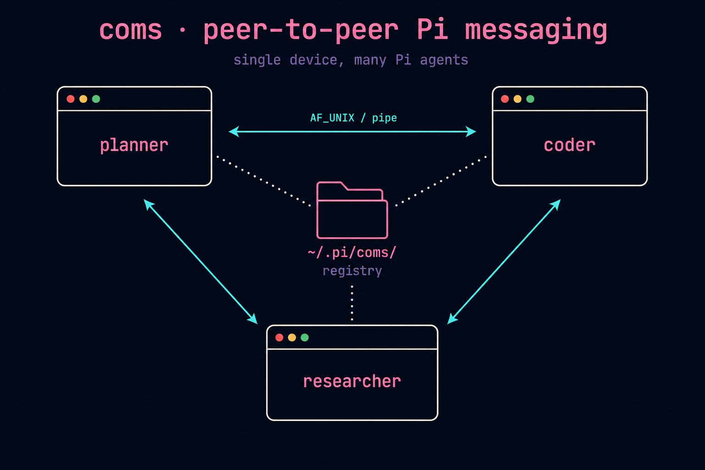

`coms` is a Pi extension that lets multiple Pi agents on the same machine discover each other and exchange prompts as queued, non-blocking messages. Each agent listens on **one** socket that handles every inbound message type. Discovery is handled through per-project registry files; delivery is handled through unix domain sockets on POSIX and named pipes on Windows.

The whole feature ships as a single self-contained extension (`extensions/coms.ts`), in keeping with the convention used by the rest of the playground — every `extensions/*.ts` is a top-level standalone agent (`extensions/subagent-widget.ts`, `extensions/agent-team.ts`, `extensions/agent-chain.ts`, etc.).

### Design priorities

- **Single socket per agent.** One endpoint accepts prompts, responses, and liveness pings. Discriminated by `type` field on the envelope.
- **Filesystem for discovery, sockets for delivery.** Files are durable and trivially debuggable; sockets are fast and signal disconnection cleanly.
- **No daemons.** No central broker, no background services. Agents coordinate themselves.
- **No locking.** Per-agent registry files mean readers and writers never contend.
- **Cross-platform.** Same Node code runs on macOS, Linux, and Windows.
- **Queued, non-interrupting.** Inbound prompts wait until the receiver's current turn finishes — delivered via `pi.sendMessage(..., { deliverAs: "followUp", triggerTurn: true })` (the same pattern used by `extensions/subagent-widget.ts:196-200` to inject finished subagent results back into the main agent).
- **Live pool widget, not slash-command-only.** The connected-agents view is rendered as a stackable widget above the footer (via `ctx.ui.setWidget("coms-pool", …, { placement: "belowEditor" })`) so it coexists with whatever footer/widgets other extensions register. The `/coms` command is retained only as an on-demand force-refresh shortcut.

### Where this sits in the codebase

| Existing pattern | What it does | How `coms` is different |
|------------------|--------------|-------------------------|
| `extensions/subagent-widget.ts` | Spawns *child* Pi subprocesses with persistent JSONL sessions | `coms` connects long-running, independent Pi instances as **peers** — neither is parent or child |
| `extensions/agent-team.ts` | Single dispatcher delegates to specialist agents in-process | `coms` is fully decentralized — every Pi instance is both a sender and receiver |
| `extensions/agent-chain.ts` | Sequential pipeline within one Pi process | `coms` is async fan-out across multiple Pi processes, with hop limits to prevent loops |
| `extensions/cross-agent.ts` / `extensions/system-select.ts` | Discover **definitions** (`.pi/agents/*.md`) on disk | `coms` discovers **running instances** at `~/.pi/coms/projects/*/agents/*.json` |
| `extensions/damage-control.ts` | Audits local tool calls against YAML rules | `coms` uses `pi.appendEntry("coms-log", …)` (same persistence channel as `damage-control-log` in `extensions/damage-control.ts:191,201`) for an audit trail of every send/receive |

## 2. Filesystem layout

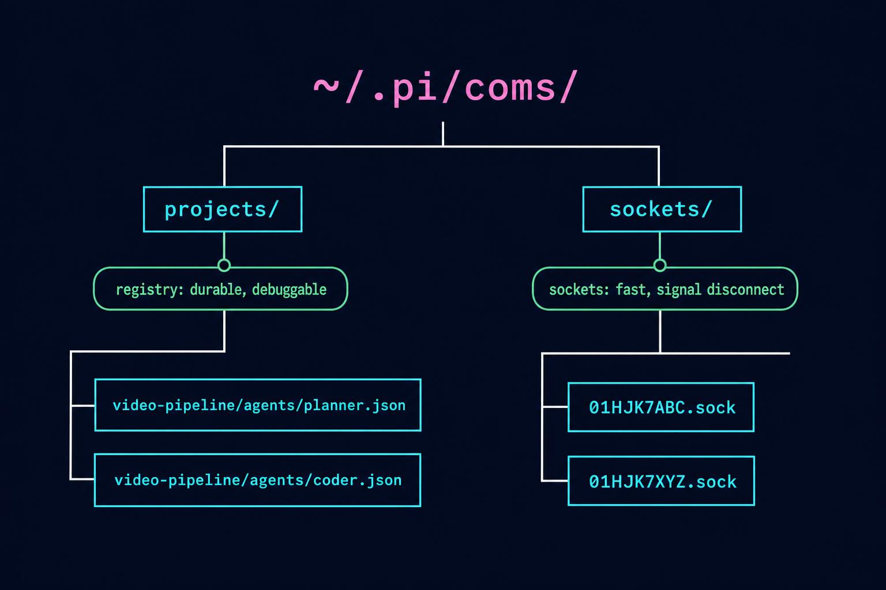

All state lives under `${PI_COMS_DIR:-~/.pi/coms/}` (POSIX) or `%USERPROFILE%\.pi\coms\` (Windows). The root directory is `chmod 0700` on POSIX; on Windows it inherits the user-profile ACL.

```
~/.pi/coms/
├── projects/
│   ├── video-pipeline/
│   │   └── agents/
│   │       ├── planner.json
│   │       └── coder.json
│   └── default/
│       └── agents/
└── sockets/                      # POSIX only; Windows uses named pipes (no file)
    ├── 01HJK7ABC.sock
    └── 01HJK7XYZ.sock
```

This is intentionally adjacent to existing Pi state directories — the codebase already uses `~/.pi/agent/sessions/subagents/` (`extensions/subagent-widget.ts:46`) and project-local `.pi/agent-sessions/` (`extensions/agent-team.ts:148-152`). `~/.pi/coms/` is a sibling, not nested inside them, because its lifecycle (live-instance registry) is distinct from session storage.

### Registry entry

`~/.pi/coms/projects/{project}/agents/{name}.json`:

```json
{
  "session_id": "01HJK7ABCDEFGHJKMNPQRSTVWX",
  "name": "planner",
  "purpose": "Plans the video production pipeline, audio-first",
  "model": "claude-opus-4-7",
  "color": "#36F9F6",
  "pid": 42891,
  "endpoint": "/Users/dan/.pi/coms/sockets/01HJK7ABC.sock",
  "cwd": "/Users/dan/projects/video-pipeline",
  "started_at": "2026-05-07T14:22:01Z",
  "explicit": false,
  "version": 1,
  "context_used_pct": 23,
  "queue_depth": 0,
  "heartbeat_at": "2026-05-07T14:22:31Z"
}
```

`color` is sourced from the agent's frontmatter (§7) and used as the per-agent swatch in every other agent's pool widget. If absent or invalid, the receiver falls back to a deterministic palette cycle (§10).

`context_used_pct`, `queue_depth`, and `heartbeat_at` are a live status snapshot refreshed on every heartbeat (every `KEEPALIVE_INTERVAL_MS`, currently 30 s). The keepalive timer rewrites the entry atomically each tick — so the registry file doubles as both an identity card and a live status snapshot. These fields are optional: older entries written before this change still parse cleanly. The same heartbeat write also self-heals if another agent's `pruneDeadEntries` mistakenly unlinked our file (audited as `event: "self_heal"` in `coms-log`).

`endpoint` is opaque — a unix socket path on POSIX or a named pipe path on Windows. Senders pass it directly to `net.createConnection({ path: endpoint })` without inspecting it.

The frontmatter parser used to populate `name` / `purpose` is the same pattern already in the codebase — see `parseAgentFile` in `extensions/agent-team.ts:79-105`, `extensions/agent-chain.ts:135-160`, and `extensions/system-select.ts:29-38`. `coms.ts` should reuse that exact pattern (small inline function, no shared helper) to stay consistent.

## 3. Cross-platform support

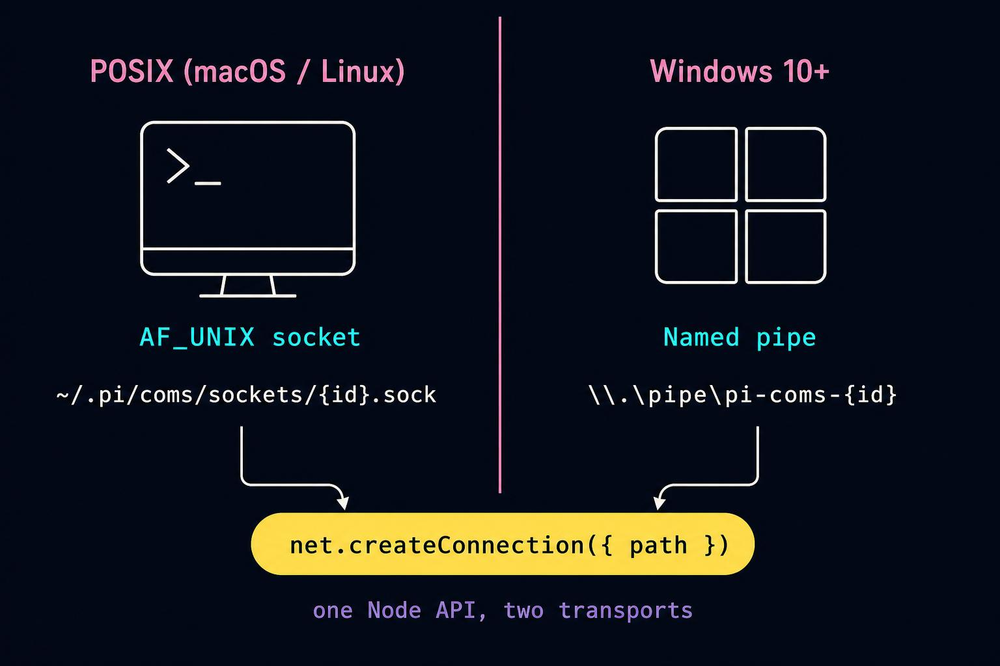

| Platform | Transport | Endpoint format |
|----------|-----------|-----------------|
| macOS | AF_UNIX | `~/.pi/coms/sockets/{session_id}.sock` |
| Linux | AF_UNIX | `~/.pi/coms/sockets/{session_id}.sock` |
| Windows 10 1803+ | named pipe (preferred) | `\\.\pipe\pi-coms-{session_id}` |

Node's `net` module abstracts both via the same `listen(path)` / `createConnection({ path })` API. Each agent picks the correct format at startup:

```ts
function makeEndpoint(sessionId: string): string {
  if (process.platform === "win32") {
    return `\\\\.\\pipe\\pi-coms-${sessionId}`;
  }
  return path.join(comsDir, "sockets", `${sessionId}.sock`);
}
```

The endpoint string is written into the registry entry verbatim; senders never recompute it.

### Platform notes

- **Path length:** `sun_path` is 108 chars on Linux, 104 on macOS. ULID-based filenames in `~/.pi/coms/sockets/` stay well under both for normal home directories.
- **Stale endpoints:** named pipes on Windows auto-clean when the listening process exits. AF_UNIX socket files persist after a crash and must be unlinked on next bind (see §5).
- **Permissions:** POSIX uses filesystem mode `0700` on the root dir. Windows relies on user-profile ACL, which is private by default.

### ULID generation

`package.json` does not currently ship `ulid` and v1 should not add a runtime dep just for this — generate ULIDs inline using `crypto.randomBytes` + Crockford base32, or fall back to `crypto.randomUUID()` and strip dashes. Keep the helper in `coms.ts` (≤ 25 lines).

## 4. Protocol

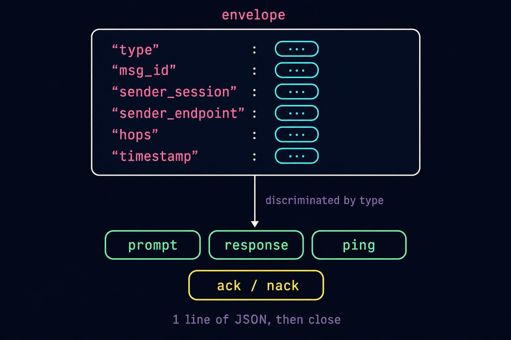

All messages are **line-delimited JSON over the agent's single socket.** One JSON object per line, terminated by `\n`. Each connection carries one request and one acknowledgment, then closes. No long-lived connections.

### Common envelope fields

Every message carries:

```ts
type Envelope = {
  type: "prompt" | "response" | "ping";
  msg_id: string;              // ULID
  sender_session: string;      // sender's session_id
  sender_endpoint: string;     // sender's listening endpoint (for callbacks)
  hops: number;                // incremented per hop, rejected if > MAX_HOPS
  timestamp: string;           // ISO 8601 UTC
};
```

Plus type-specific fields (below).

### Message types

#### `prompt`

Request the receiver to process something.

```json
{
  "type": "prompt",
  "msg_id": "01HJK7PROMPT01...",
  "sender_session": "01HJK7ABC...",
  "sender_endpoint": "/Users/dan/.pi/coms/sockets/01HJK7ABC.sock",
  "sender_name": "planner",
  "sender_cwd": "/Users/dan/projects/video-pipeline",
  "hops": 0,
  "timestamp": "2026-05-07T14:22:01Z",
  "prompt": "Review src/audio_producer.py for audio-first violations",
  "conversation_id": null,
  "response_schema": null
}
```

Receiver acks immediately, queues the prompt for next-turn injection. When the receiver's agent has produced a response, the `coms` extension opens a fresh connection to `sender_endpoint` and sends a `response` keyed by the same `msg_id`.

**Pi-side delivery.** Once the prompt has been queued, the receiver's `coms` extension calls:

```ts
pi.sendMessage(
  {
    customType: "coms-inbound",
    content: `[from ${env.sender_name} @ ${env.sender_cwd}]\n\n${env.prompt}`,
    display: true,
    details: { msg_id, sender_session, response_schema },
  },
  { deliverAs: "followUp", triggerTurn: true },
);
```

This is the exact pattern `extensions/subagent-widget.ts:196-200` uses to deliver finished subagent output back into a parent turn — the inbound prompt becomes a follow-up message on the receiver's next turn boundary, never interrupting an in-flight tool call.

#### `response`

Reply to a prior `prompt`.

```json
{
  "type": "response",
  "msg_id": "01HJK7PROMPT01...",
  "sender_session": "01HJK7XYZ...",
  "sender_endpoint": "/Users/dan/.pi/coms/sockets/01HJK7XYZ.sock",
  "hops": 0,
  "timestamp": "2026-05-07T14:24:18Z",
  "response": "Found three violations: ...",
  "error": null
}
```

`response` may be a string or a structured object validated against `response_schema` from the prompt. `error` is populated if the receiver could not produce a valid response (validation failure, agent error, etc.); `response` is then null.

**Receiver-side capture.** The receiver's extension hooks `agent_end` (the same hook `extensions/tilldone.ts:365-383` uses to nudge incomplete tasks) to detect that a turn has finished. If the most-recently-queued `coms-inbound` has no response yet, it captures the assistant's final text from `ctx.sessionManager.getBranch()` (see `extensions/tool-counter.ts:39-46` for the same branch-walk pattern) and dispatches the `response` envelope back to `sender_endpoint`.

#### `ping`

Liveness + identity check. Used by `coms_list` to verify a registry entry corresponds to a live, responsive agent and to retrieve current context-window usage.

```json
{
  "type": "ping",
  "msg_id": "01HJK7PING01...",
  "sender_session": "01HJK7ABC...",
  "sender_endpoint": "/Users/dan/.pi/coms/sockets/01HJK7ABC.sock",
  "hops": 0,
  "timestamp": "2026-05-07T14:22:01Z"
}
```

Receiver responds **inline on the same connection** (not via callback) with a `pong`:

```json
{
  "type": "pong",
  "msg_id": "01HJK7PING01...",
  "agent_card": {
    "name": "coder",
    "purpose": "Writes and edits code",
    "model": "claude-sonnet-4-7",
    "color": "#FF7EDB",
    "context_used_pct": 34,
    "queue_depth": 0
  }
}
```

`context_used_pct` is sourced from `ctx.getContextUsage()` — the same call already used in `extensions/minimal.ts:21-24` and `extensions/tool-counter.ts:53-54`. `color` is propagated from the responder's registry entry so the pool widget can render it without re-reading the file. Then the connection closes.

### Acknowledgments

Every `prompt` and `response` is acked synchronously on the same connection before close:

```json
{ "type": "ack", "msg_id": "..." }
```

Or, on rejection:

```json
{ "type": "nack", "msg_id": "...", "error": "hops exceeded" }
```

Reasons for `nack`: `"hops exceeded"`, `"queue full"`, `"unknown type"`, `"malformed envelope"`, `"agent shutting down"`.

### Hop limit

Default `MAX_HOPS = 5` (overridable via `PI_COMS_MAX_HOPS`). The receiver inspects `hops` on every prompt and rejects with `nack` if it exceeds the limit. When an agent forwards work to another agent (sends a derived prompt as a result of an inbound prompt), it must increment `hops` by 1 from the inbound message. Track the "current inbound hops" in a per-extension `let inboundContext: { hops: number } | null` that's set when delivering a `coms-inbound` follow-up and cleared in `agent_end`.

## 5. Agent lifecycle

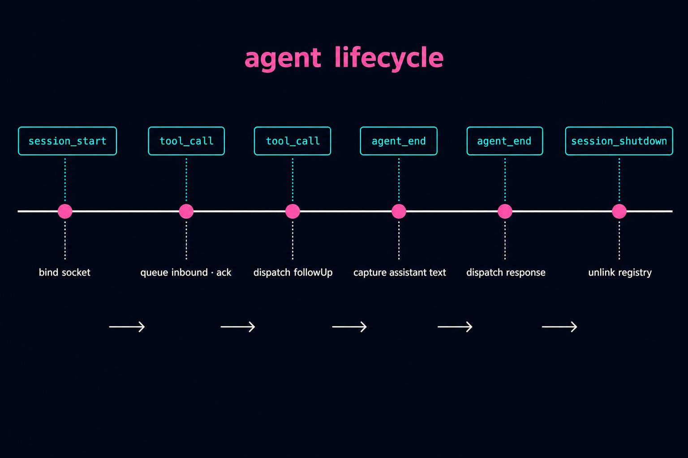

The lifecycle below maps directly to Pi extension hooks. The full set of hooks available to extensions is documented at https://raw.githubusercontent.com/badlogic/pi-mono/refs/heads/main/packages/coding-agent/docs/extensions.md.

### Startup — `pi.on("session_start", …)`

This handler is the entry point. Mirrors the pattern in `extensions/agent-team.ts:671-733` and `extensions/damage-control.ts:61-86`:

1. Call `applyExtensionDefaults(import.meta.url, ctx)` (per `extensions/themeMap.ts:140-143` convention; every extension does this first).
2. Generate `session_id` (ULID).
3. Compute `endpoint` per platform (§3).
4. Create dirs if missing: `~/.pi/coms/projects/{project}/agents/`, `~/.pi/coms/sockets/`.
5. Bind the socket / pipe at `endpoint`.
   - **POSIX:** if the socket file exists, attempt `connect`. On `ECONNREFUSED`, unlink and rebind. On success, abort with a clear "endpoint already in use" error (the session_id collision indicates a bug, not normal operation).
   - **Windows:** named pipe binding does not require pre-existence checks; OS handles uniqueness.
6. Start accepting connections (handler from §6).
7. **Resolve a unique name:** scan the project's existing live entries; if `name` collides, append the smallest free integer ≥ 2 (e.g. `planner` → `planner2`). Stale entries (dead PID) are reclaimed automatically by `pruneDeadEntries`. The resolved name flows through to the registry filename, `identity.name`, status-line label, boot-notify line, and top-border tag. Collisions are recorded in the audit log as `event: "name_collision"`.
8. Write registry entry to `~/.pi/coms/projects/{project}/agents/{name}.json`. **Atomic:** write to `{name}.json.tmp`, then `rename` to `{name}.json`.
9. Install `SIGINT` / `SIGTERM` handlers that invoke clean shutdown.
10. Start a 30-second heartbeat interval that atomically rewrites the registry entry with a fresh live-status snapshot (`context_used_pct`, `queue_depth`, `heartbeat_at`, current `model`). The atomic rewrite both bumps `mtime` (soft liveness signal in addition to pid checks) and self-heals if the file was unlinked between heartbeats — when a missing file is detected on the tick, an `event: "self_heal"` entry is appended to `coms-log`.
11. Call `ctx.ui.setStatus("coms", "📡 coms: <name>@<project>")` to surface presence in the footer (same convention as `extensions/damage-control.ts:85` and `extensions/tilldone.ts:288-294`).
12. Optionally `ctx.ui.notify(...)` a one-line boot summary listing peers visible at startup, mirroring `extensions/cross-agent.ts:208-291`.

### Runtime — connection handler

Per accepted connection:

1. Read up to one line (`\n` terminator). Apply a 64KB cap; oversize → `nack { error: "malformed envelope" }`, close.
2. Parse JSON; on parse failure → `nack`, close.
3. Validate envelope (`type`, `msg_id`, `sender_session`, `sender_endpoint` all present); on failure → `nack`.
4. Dispatch by `type`:
   - **`prompt`:** validate hops, append to follow-up queue keyed by `msg_id`, write `ack`, close. Then call `pi.sendMessage` (see §4 prompt block) to inject the prompt as a follow-up.
   - **`response`:** look up `msg_id` in pending-replies table. If found, store response, resolve any awaiting Promise, write `ack`. If not found (sender restarted or unknown), still ack and log warning.
   - **`ping`:** write `pong` with current Agent Card (name, purpose, model, context_used_pct from `ctx.getContextUsage()`, queue_depth), close.
5. On any handler exception, send `nack` with `error: "internal error"`, log via `pi.appendEntry("coms-log", { … })`, close. Do not crash the listener.

### Runtime — outbound send

When the agent calls `coms_send(target, prompt, opts)`:

1. Resolve `target` against the registry: read all `~/.pi/coms/projects/{caller_project}/agents/*.json`, find by `name` (or `session_id`). Honor `--explicit` filtering unless `target` is an exact `name` match.
2. Generate `msg_id` (ULID).
3. Build envelope with `hops` set from current inbound context (if processing an inbound message, `hops = inbound.hops + 1`; else `0`).
4. Open connection to `target.endpoint`.
5. Write envelope as one line + `\n`.
6. Read one line (the ack/nack). On `nack`, throw with `error` text.
7. Close connection.
8. Register `msg_id` in the pending-replies table with a Promise that `coms_await(msg_id)` will resolve.
9. Return `{ msg_id }` to the caller synchronously.

### Detecting "turn done" — `pi.on("agent_end", …)`

When the receiver's agent finishes its turn, look up the `msg_id` for the most recent unfulfilled `coms-inbound` (stored in a small in-memory map from `session_start`), grab the assistant's final text from `ctx.sessionManager.getBranch()` (filtering for the last `assistant` message in branch order — see `extensions/tool-counter.ts:39-46` for the same iteration pattern), and dispatch a `response` envelope to `sender_endpoint`.

If the response_schema was provided in the inbound prompt, validate the assistant's output against it before sending; on validation failure, dispatch `{ error: "response did not match schema", response: null }`.

### Shutdown (clean)

Hook `pi.on("session_shutdown", …)` (and a `process.on("SIGINT"/"SIGTERM", …)` fallback for hard exits):

1. Stop accepting new connections.
2. Drain in-flight handlers with a 5-second timeout.
3. Unlink socket file (POSIX only).
4. Unlink registry entry.
5. Append a final `pi.appendEntry("coms-log", { event: "shutdown", session_id })`.
6. Exit.

### Crash recovery

- **Stale socket file (POSIX):** detected on next bind by trying `connect` first (§5 step 5).
- **Stale registry entry:** `coms_list` filters out entries whose `pid` is dead via `process.kill(pid, 0)` returning `ESRCH`. Optionally unlinks the stale entry on detection.
- **In-flight messages lost:** sender's `coms_await` times out, sender can decide to retry against a different agent. There is no replay log in v1.

## 6. Tool surface

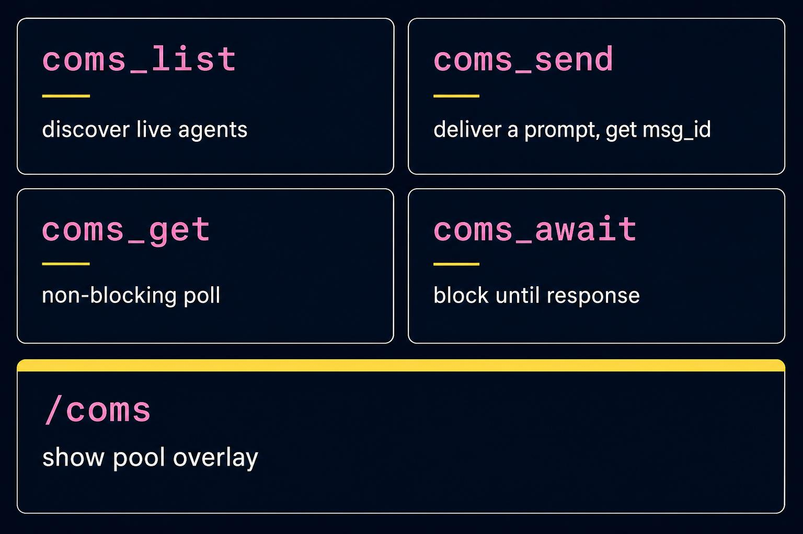

The extension registers four tools the Pi agent can call, plus one slash command. Tool names use snake_case to match existing Pi conventions (`dispatch_agent`, `subagent_create`, `query_expert`, `run_chain`, `tilldone`).

All four are registered with `pi.registerTool(...)` using `Type.Object(...)` schemas from `@sinclair/typebox` — the same pattern as `extensions/subagent-widget.ts:218-247`, `extensions/agent-team.ts:469-561`, and `extensions/agent-chain.ts:508-589`. Each tool also gets a `renderCall` and `renderResult` to keep the chat UI tidy (see `extensions/tilldone.ts:619-708` for a thorough renderer example, and `extensions/agent-team.ts:517-560` for a streaming/partial-result example).

### `coms_list`

```ts
list(opts?: {
  project?: string;          // default: caller's project; "*" for all
  include_explicit?: boolean; // default: false
}): Agent[]

type Agent = {
  name: string;
  session_id: string;
  purpose: string;
  model: string;
  cwd: string;
  alive: boolean;
  context_used_pct: number | null;  // populated via ping; null on ping failure
};
```

Hides `explicit: true` agents unless `include_explicit: true` or the caller is later targeting one by exact name.

### `coms_send`

```ts
send(target: string, prompt: string, opts?: {
  conversation_id?: string;
  response_schema?: object;        // JSON Schema
}): { msg_id: string }
```

`target` matches by `name` (preferred, scoped to caller's project) or `session_id` (global). Returns synchronously after the receiver acks. Throws if the receiver is unreachable, sends `nack`, or the connection fails.

### `coms_get`

```ts
get(msg_id: string): {
  status: "pending" | "complete" | "error";
  response?: any;
  error?: string;
}
```

Non-blocking poll of the sender's pending-replies table.

### `coms_await`

```ts
await(msg_id: string, opts?: { timeout_ms?: number }): {
  response: any
} | {
  error: string
}
```

Blocks until the response lands or `timeout_ms` fires (default: 30 minutes). Internally a `Promise.race` between the pending-replies entry and a timer.

### Pool widget (primary surface)

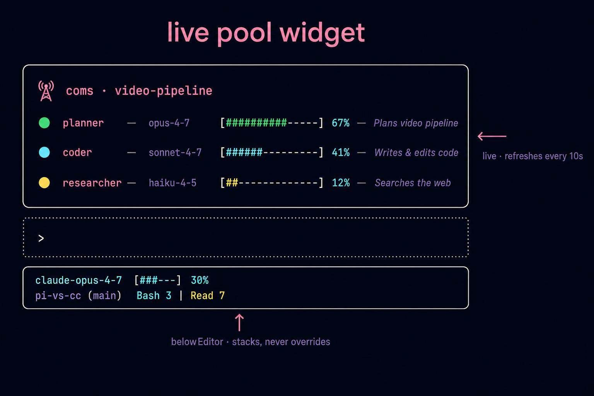

The widget — not the slash command — is the primary way to see connected agents. It's a live, stackable widget rendered above the editor's footer:

```ts
ctx.ui.setWidget("coms-pool", (_tui, theme) => ({ … }), { placement: "belowEditor" });
```

This is **the same primitive** `extensions/theme-cycler.ts:42-69` uses for the theme swatch and `extensions/tilldone.ts:179-215` uses for the "current task" widget — both of which already coexist with the footers from `minimal.ts`, `tool-counter.ts`, etc. without overriding them. **Use `setWidget`, never `setFooter`** — calling `setFooter` would clobber whatever footer the user has stacked from another extension.

#### What the widget shows

One row per connected agent, drawn in monospace so columns line up:

```
📡 coms · video-pipeline
● planner      opus-4-7     [##########-----] 67%  — Plans video pipeline
● coder        sonnet-4-7   [######---------] 41%  — Writes & edits code
● researcher   haiku-4-5    [##-------------] 12%  — Searches the web
```

Per-row composition (left → right):

| Column | Source | Theme token / color |
|--------|--------|---------------------|
| `●` swatch | agent's `color` from frontmatter / pong | the agent's hex literal (not a theme token) |
| name | registry `name` | `accent` |
| model | registry `model`, abbreviated | `dim` |
| `[…]` brackets | static | `warning` |
| filled `#` chars | `context_used_pct` | the agent's hex literal |
| empty `-` chars | static | `dim` |
| `N%` | `context_used_pct` | `accent` |
| `—` | static | `dim` |
| purpose | registry `purpose`, truncated | `muted` |

A header line at top reads `📡 coms · <project>` in `accent`. Empty pool: a single dim line `coms · no peers connected`.

#### How it stays live

- An interval timer (`setInterval`, default `PI_COMS_PING_INTERVAL_MS = 10000`, see §7) pings every registered peer in parallel, collects their `pong` agent_cards, updates an in-memory `peerCards: Map<sessionId, AgentCard>` keyed by session_id, and calls `tui.requestRender()` (same pattern as `extensions/agent-team.ts:333-336` and `extensions/agent-chain.ts:372-375`).
- The widget render closure reads from `peerCards` — never from the filesystem during render — so renders stay cheap.
- Stale entries (no successful ping for 3 cycles, or `process.kill(pid, 0) === ESRCH`) get a dim ✗ swatch and grey-out the row; cleared after 6 cycles.
- The interval is cleared on `session_shutdown` (and SIGINT/SIGTERM) along with the listener.

#### Stacking guarantees

The widget uses a unique key (`"coms-pool"`) so it doesn't collide with `tilldone-current`, `theme-swatch`, `tool-counter`, `agent-team`, etc. Multiple extensions can register widgets with different keys and they all render. The footer remains untouched — `coms.ts` never calls `ctx.ui.setFooter`.

### `/coms` slash command (force-refresh + filters)

Demoted to a quick utility. Registered with `pi.registerCommand("coms", { … })` (pattern from `extensions/subagent-widget.ts:330-465`). Behaviors:

- **No args** — fires an immediate ping cycle and re-renders the widget. Useful when you just spawned a peer and don't want to wait 10s.
- **`--all`** — toggles the widget to also include `explicit: true` agents (with a `*` marker prepended to the name).
- **`--project <name>`** — switches the widget's displayed project pool. Persisted on the extension instance until the next `--project` or `session_start`.

The slash command does NOT print a one-shot notification anymore — it manipulates the widget state and re-renders.

## 7. Configuration

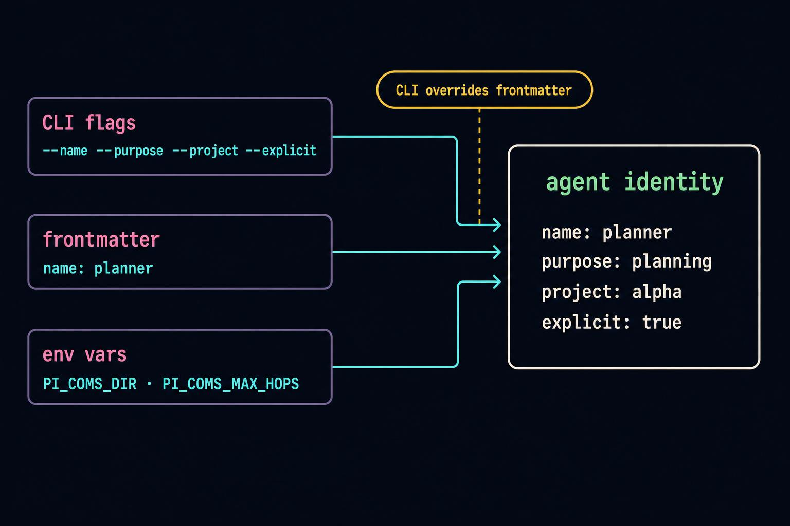

### CLI flags (passed to `pi`)

| Flag | Default | Notes |
|------|---------|-------|
| `--name <string>` | frontmatter `name` | identity in the registry |
| `--purpose <string>` | frontmatter `description` | shown in `coms_list` and `/coms` |
| `--project <string>` | `default` | scopes discovery and `coms_list` |
| `--color <#RRGGBB>` | frontmatter `color` | swatch color in pool widget |
| `--explicit` | false | hides agent from auto-discovery |

CLI flags are declared via `pi.registerFlag(name, { type, default, description })` calls at the top of the extension's default export — this is required so pi's CLI parser accepts them (otherwise pi 0.73+ aborts with `Error: Unknown options: --name, --project, ...` before extensions load). Values are then read inside `session_start` via `pi.getFlag(name)`. See https://raw.githubusercontent.com/badlogic/pi-mono/refs/heads/main/packages/coding-agent/docs/extensions.md.

### System prompt frontmatter

The system-prompt path is read from `--system-prompt <path>` (preferred — overwrites pi's default system prompt) or `--append-system-prompt <path>` (fallback — appends). These are pi-builtin flags, so the extension scans `process.argv` for them directly rather than registering them. First match wins, in preference order.

If launched with a system prompt file containing YAML frontmatter:

```yaml
---
name: planner
description: Plans the video production pipeline, audio-first
color: "#36F9F6"
---
You are the planner agent...
```

| Field | Used for |
|-------|----------|
| `name` | registry filename + identity in pool widget |
| `description` | shown as `purpose` in the pool widget right column |
| `color` | hex literal (`#RRGGBB`) for the agent's swatch dot and progress-bar fill in every peer's pool widget |

CLI flags override frontmatter. The frontmatter parser is the same simple `^---\n([\s\S]*?)\n---\n([\s\S]*)$` regex used in `extensions/agent-team.ts:79-105`, `extensions/agent-chain.ts:135-160`, `extensions/system-select.ts:29-38`, and `extensions/cross-agent.ts:55-67`. Reuse, don't import.

`color` validation: must match `/^#[0-9a-fA-F]{6}$/`. Invalid or missing → fall back to the palette cycle in §10. The validated value is stored in the registry entry and propagated on every `pong`.

### Environment variables

| Variable | Default | Purpose |
|----------|---------|---------|
| `PI_COMS_DIR` | `~/.pi/coms/` | overrides root storage location |
| `PI_COMS_MAX_HOPS` | `5` | hop limit before `nack` |
| `PI_COMS_TIMEOUT_MS` | `1800000` | default `coms_await` timeout (30 min) |
| `PI_COMS_PING_INTERVAL_MS` | `10000` | pool widget refresh cadence |

## 8. Worked example

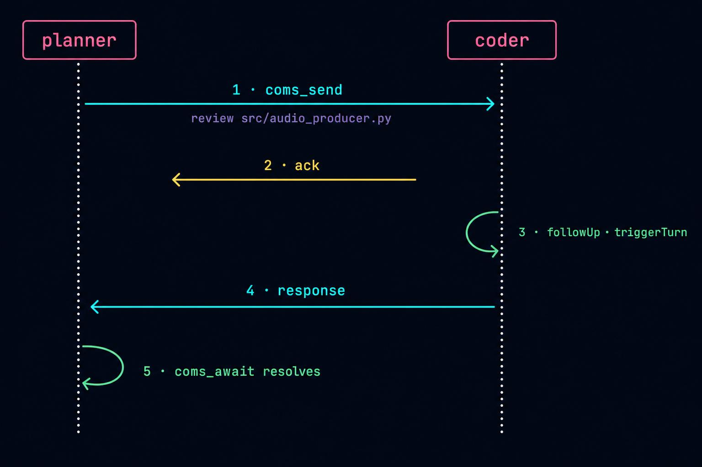

The `planner` agent asks the `coder` agent to review a file. Both are in the `video-pipeline` project on the same Mac.

**Setup:** both agents launched and registered. Registry contains `planner.json` (endpoint `~/.pi/coms/sockets/01HJK7ABC.sock`) and `coder.json` (endpoint `~/.pi/coms/sockets/01HJK7XYZ.sock`).

**Step 1 — planner discovers coder.**

```
planner.tool_call("coms_list")
→ extension reads ~/.pi/coms/projects/video-pipeline/agents/*.json
→ for each entry, ping target via socket → get pong with context_used_pct
→ returns [{name: "coder", ...}, ...]
```

**Step 2 — planner sends prompt.**

```
planner.tool_call("coms_send", {
  target: "coder",
  prompt: "Review src/audio_producer.py for audio-first violations",
  response_schema: { type: "object", properties: { violations: { type: "array" } } }
})

extension:
1. resolves target → endpoint = ~/.pi/coms/sockets/01HJK7XYZ.sock
2. opens connection to that endpoint
3. writes one line:
   {"type":"prompt","msg_id":"01HJK7P01...","sender_session":"01HJK7ABC...",
    "sender_endpoint":"/Users/dan/.pi/coms/sockets/01HJK7ABC.sock",
    "sender_name":"planner","sender_cwd":"/Users/dan/projects/video-pipeline",
    "hops":0,"timestamp":"2026-05-07T14:22:01Z","prompt":"Review src/...",
    "conversation_id":null,"response_schema":{...}}
4. reads ack: {"type":"ack","msg_id":"01HJK7P01..."}
5. closes connection
6. registers msg_id in pending-replies, returns {msg_id: "01HJK7P01..."}
```

**Step 3 — coder receives, queues, processes.**

```
coder's listener accepts connection:
1. reads prompt line
2. validates envelope, hops=0 < 5 ✓
3. calls pi.sendMessage(..., {deliverAs:"followUp", triggerTurn:true})
4. writes ack, closes connection

later, on next turn boundary:
5. coder's agent receives the prompt as a follow-up message
6. coder reasons, reads the file, identifies violations, produces structured response
7. coms hooks agent_end → walks ctx.sessionManager.getBranch() for the
   last assistant text, validates against response_schema
```

**Step 4 — coder sends response back.**

```
coder's coms extension intercepts the agent's final response:
1. opens connection to sender_endpoint = ~/.pi/coms/sockets/01HJK7ABC.sock
2. writes one line:
   {"type":"response","msg_id":"01HJK7P01...","sender_session":"01HJK7XYZ...",
    "sender_endpoint":"/Users/dan/.pi/coms/sockets/01HJK7XYZ.sock",
    "hops":0,"timestamp":"2026-05-07T14:24:18Z",
    "response":{"violations":[...]},"error":null}
3. reads ack: {"type":"ack","msg_id":"01HJK7P01..."}
4. closes connection
```

**Step 5 — planner retrieves response.**

```
planner.tool_call("coms_await", { msg_id: "01HJK7P01..." })
→ extension's pending-replies table already has the entry (resolved in step 4)
→ returns {response: {violations: [...]}}
```

Total wire footprint: four ephemeral connections, one prompt line, one response line, two acks. No long-lived state on the wire; in-memory state is just the pending-replies table on each side.

## 9. Edge cases & failure modes

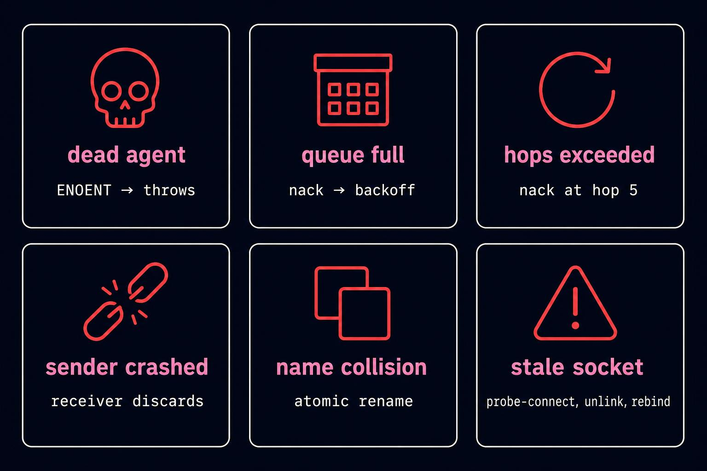

| Scenario | Behavior |
|----------|----------|
| Send to dead agent | `ENOENT` / `ECONNREFUSED` → `coms_send` throws clearly. Caller can `coms_list` to refresh. |
| Send to overloaded agent | Receiver returns `nack` with `"queue full"`. Caller can retry with backoff. |
| Hop limit exceeded | Receiver returns `nack` with `"hops exceeded"`. `coms_await` times out. |
| Receiver crashes mid-process | `coms_await` times out. Sender can `coms_list` to confirm dead, retry against another agent. |
| Sender crashes after sending | Receiver's response attempt fails fast (`ENOENT`). Receiver logs and discards. |
| Two agents register the same name | The second agent's name is auto-suffixed (`planner` → `planner2` → `planner3`). The first agent retains the unsuffixed name. Both run normally. Audit log records `event: "name_collision"`. |
| Stale socket file from prior crash | Detected on bind via probe-`connect`, unlinked, rebind. |
| Response arrives for unknown `msg_id` | Ack and log; do not error. Sender may have restarted. |
| Malformed JSON on the wire | `nack { error: "malformed envelope" }`, close. |
| Connection drops mid-write | Standard Node EPIPE handling; sender treats as send failure. |
| Receiver's agent_end fires for a turn that was *not* a coms-inbound | No-op — only respond if the most-recent inbound has no response yet. |
| `response_schema` validation fails | Dispatch `response` with `error: "schema mismatch"`, `response: null`. |
| Receiver shutting down with queued prompts | `nack { error: "agent shutting down" }` for any new connections; drain/abandon already-queued ones. |

## 10. Theming, justfile, themeMap

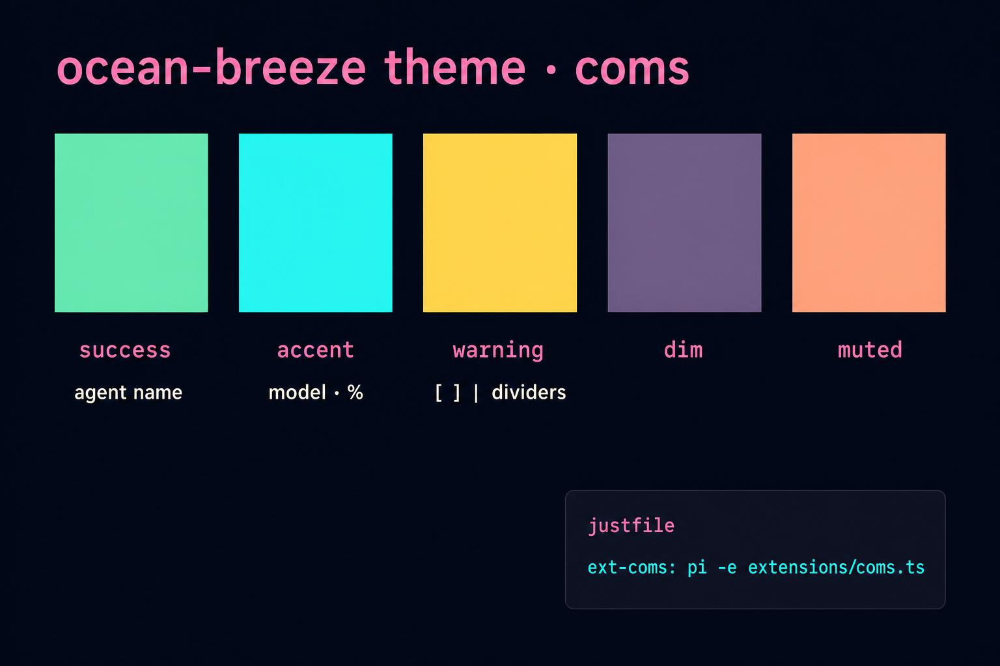

To stay consistent with the rest of the playground:

**`extensions/themeMap.ts`** — add an entry:

```ts
"coms": "ocean-breeze",   // cross-boundary, connecting (mirrors cross-agent.ts assignment)
```

**`justfile`** — add a recipe in the appropriate section (after the g3 block, before `#ext`):

```just
# 17. Coms: peer-to-peer messaging between Pi agents on the same machine
ext-coms:
    pi -e extensions/coms.ts -e extensions/minimal.ts -e extensions/theme-cycler.ts
```

**`THEME.md` color roles** apply to all `coms` UI surfaces (status line, pool widget chrome) — follow the table at `THEME.md:7-13`.

### Per-agent color fallback palette

When an agent's frontmatter omits `color` (or the value fails validation), assign one deterministically from this 8-entry palette by hashing `session_id`:

```
#72F1B8  green     (success)
#36F9F6  cyan      (accent)
#FF7EDB  pink      (secondary)
#FEDE5D  amber     (warning)
#C792EA  purple    (synthwave purple)
#FF8B39  orange    (synthwave orange)
#4D9DE0  blue      (synthwave blue)
#FFAA8B  peach     (muted)
```

These all come from the `synthwave` theme (`.pi/themes/synthwave.json`). Hash → `palette[Number(BigInt('0x' + sha256(session_id).slice(0, 8))) % 8]`. The fallback is stable across restarts of the same agent and visually distinct enough at 5–8 peers.

## 11. File structure

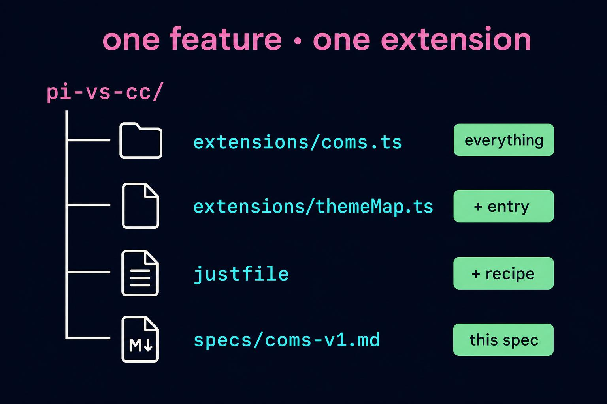

The whole feature is one file plus a justfile/themeMap entry:

```
extensions/coms.ts          # everything: tools, command, listener, dispatch, lifecycle
extensions/themeMap.ts      # add "coms" → "ocean-breeze"
justfile                    # add ext-coms recipe
specs/coms-v1.md            # this spec
```

No new files under `.pi/`. The registry under `~/.pi/coms/` is created on first run.

## 12. Out of scope (v1)

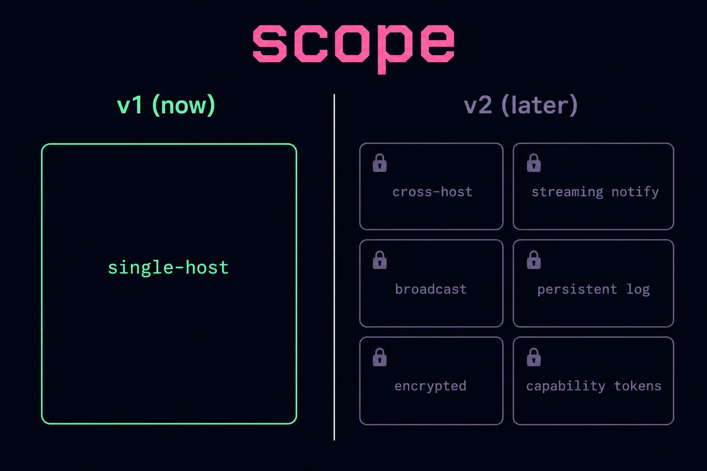

- **Cross-host communication.** v2 introduces an optional bridge daemon that exposes the local pool over HTTP + A2A protocol.
- **Streaming responses.** v2 adds `notify` messages for progress updates between ack and final response.
- **Broadcast / topic routing.** v2 adds `coms_broadcast(purpose_pattern, prompt)`.
- **Persistent message log.** v1 has no replay; in-flight messages are lost on crash. v2 may add an append-only log keyed by `msg_id` for debug and replay (the `pi.appendEntry("coms-log", …)` audit channel is already in place to extend).
- **Encrypted endpoints.** Local-only design assumes the user's home directory is private. Not appropriate for shared / multi-tenant systems.
- **Authentication.** Filesystem permissions are the only auth in v1. v2 adds capability tokens for cross-host use.
- **Multi-extension split.** v2 may extract registry/transport/protocol into helper modules; v1 stays in one file to match the playground's "one extension = one .ts" convention.

## 13. References

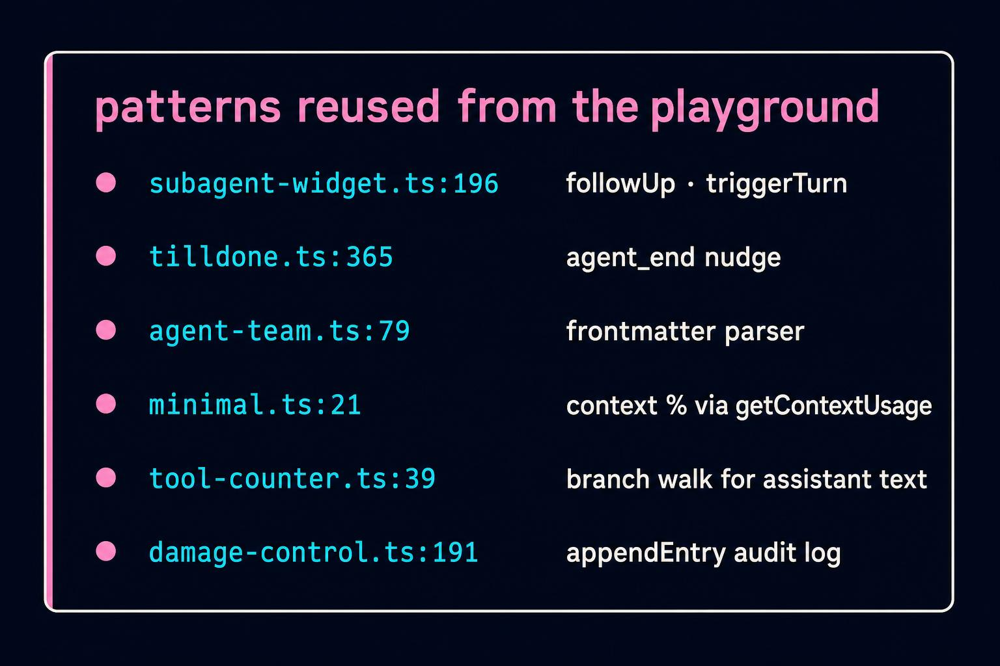

- Pi extension docs: https://raw.githubusercontent.com/badlogic/pi-mono/refs/heads/main/packages/coding-agent/docs/extensions.md
- `pi.registerFlag(name, { type, default, description })` and `pi.getFlag(name)` for declaring extension CLI flags so pi's parser accepts them — see Pi extensions docs (link above).
- Pi TUI docs: https://raw.githubusercontent.com/badlogic/pi-mono/refs/heads/main/packages/coding-agent/docs/tui.md
- `pi.sendMessage` follow-up + triggerTurn pattern: `extensions/subagent-widget.ts:196-200`
- `pi.appendEntry` audit-log pattern: `extensions/damage-control.ts:191,201`
- `agent_end` hook usage: `extensions/tilldone.ts:365-383`
- `before_agent_start` system-prompt injection: `extensions/purpose-gate.ts:70-75`, `extensions/agent-team.ts:631-667`
- `ctx.getContextUsage()`: `extensions/minimal.ts:21-24`, `extensions/tool-counter.ts:53-54`
- `ctx.sessionManager.getBranch()`: `extensions/tool-counter.ts:39-46`, `extensions/tilldone.ts:308-323`
- `pi.registerTool` with TypeBox + render hooks: `extensions/tilldone.ts:392-708`, `extensions/agent-team.ts:469-561`
- `pi.registerCommand`: `extensions/subagent-widget.ts:330-465`, `extensions/theme-cycler.ts`
- `setWidget(..., { placement: "belowEditor" })` stacking pattern: `extensions/theme-cycler.ts:42-69` (swatch widget), `extensions/tilldone.ts:179-215` (live "current task" widget), `extensions/subagent-widget.ts:52-109` (subagent cards)
- Live polling timer + `tui.requestRender()`: `extensions/agent-team.ts:333-336`, `extensions/agent-chain.ts:372-375`
- Frontmatter parser pattern: `extensions/agent-team.ts:79-105`, `extensions/system-select.ts:29-38`
- ANSI banner / multi-line notify: `extensions/cross-agent.ts:208-291`
- Theme + title bootstrap: `extensions/themeMap.ts:140-143`
- Color role conventions: `THEME.md`
